# CATopalian True AI
From Heaven to Earth, here is TRUE AI

# TRUE AI Centered
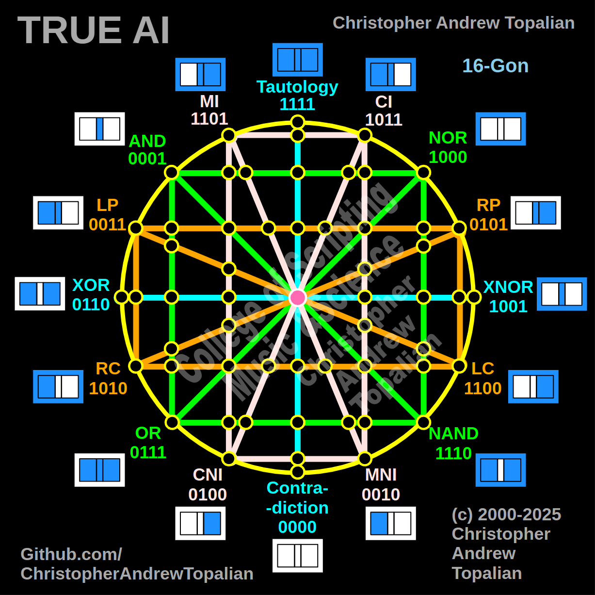  

> #

# TRUE AI
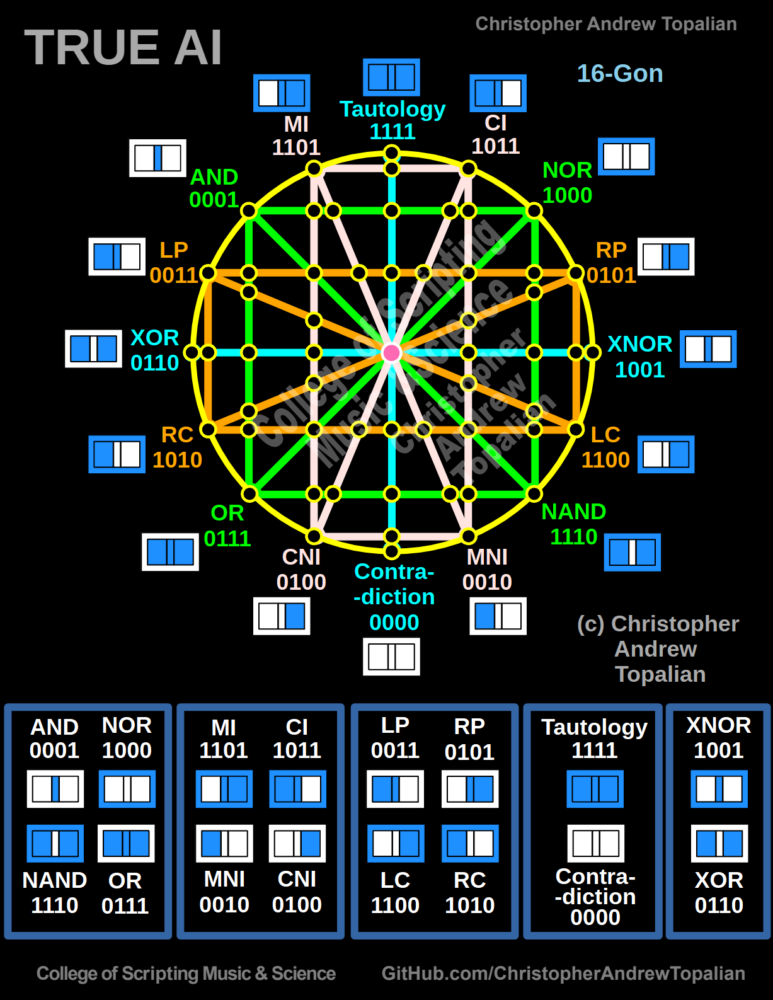  

---

# Historial Evidence that I,  Christopher Andrew Topalian, Created TRUE AI

> ## DATE: 2008-10-07-(13:45)
.PNG)  

> ## DATE: 2008-10-07-(14:15)
.PNG)  

> ## DATE: 2008-10-11-(03-29)
.PNG)  

> ## DATE: 2008-10-11-(03-34)
.PNG)  

> ## DATE: 2008-10-11-(04-20)
.PNG)  

> ## DATE: 2008-10-11-(04-07)
.PNG)  

> ## DATE: 2008-10-11-(04-33)
.PNG)  

> ## DATE: 2008-10-11-(04-37)
.PNG)  

> ## DATE: 2008-10-11-(05-45)
.PNG)  

> ## DATE: 2008-10-13-(03-13)
.PNG)  

> ## DATE: 2008-10-13-(04-51)
.PNG)  

> ## DATE: 2008-10-13-(04-54)
.PNG)  

> ## DATE: 2008-10-13-(06-46)
.PNG)  

> ## DATE: 2008-10-13-(06-54)
.PNG)  

> ## DATE: 2008-10-13-(07-17)
.PNG)  

> ## DATE: 2008-10-13-(07-24)
.PNG)  

> ## DATE: 2008-10-13-(07-32)
.PNG)  

> ## DATE: 2008-10-13-(07-33)
.PNG)  

> ## DATE: 2008-10-13-(08-14)
.PNG)  

> ## DATE: 2008-10-13-(08-16)
.PNG)  

> ## DATE: 2008-10-13-(08-57)
.PNG)  

> ## DATE: 2008-10-13-(09-03)
.PNG)  

> ## DATE: 2008-10-13-(09-17)
.PNG)  

> ## DATE: 2008-10-13-(09-19)
.PNG)  

> ## DATE: 2008-10-13-(09-30)
.PNG)  

> ## DATE: 2008-10-13-(09-32)
.PNG)  

> ## DATE: 2008-10-13-(09-42)
.PNG)  

> ## DATE: 2008-10-13-(09-45)
.PNG)  

> ## DATE: 2008-10-15-(01-18)
.PNG)  

> ## DATE: 2008-10-15-(01-22)
.PNG)  

> ## DATE: 2008-10-15-(01-46)
.PNG)  

> ## DATE: 2008-10-15-(01-48)
.PNG)  

> ## DATE: 2008-10-15-(01-55)
.PNG)  

> ## DATE: 2008-10-15-(01-58)
.PNG)  

> ## DATE: 2008-10-08-(01-15)
.PNG)  

> ## DATE: 2008-10-08-(01-18)
.PNG)  

# CATopalian Diagrams

> ## DATE: 2011-01-29-(10-16)
.PNG)  

> ## DATE: 2011-01-29-(11-18)
.PNG)  

> ## DATE: 2011-01-29-(11-21)
.PNG)  

> ## DATE: 2011-01-29-(11-47)
.PNG)  

> ## DATE: 2011-01-29-(11-51)
.PNG)  

> ## DATE: 2011-01-29-(11-54)
.PNG)  

> ## DATE: 2011-01-29-(11-57)
.PNG)  

> ## DATE: 2011-01-29-(12-01)
.PNG)  

> ## DATE: 2011-01-29-(12-04)
.PNG)  

> ## DATE: 2011-01-29-(12-08)
.PNG)  

> ## DATE: 2011-01-29-(12-11)
.PNG)  

> ## DATE: 2011-01-29-(12-13)
.PNG)  

> ## DATE: 2011-01-29-(12-15)
.PNG)  

> ## DATE: 2011-01-29-(12-18)
.PNG)  

> ## DATE: 2011-01-29-(12-21)
.PNG)  

> ## DATE: 2011-01-29-(12-23)
.PNG)  

---

## True AI Logic Summarized

> ## DATE: 2011-02-01-(05-03-45)
.PNG)  

> ## DATE: 2011-02-01-(05-03-51)
.PNG)  

> ## DATE: 2011-02-01-(05-04-00)
.PNG)  

> ## DATE: 2011-02-01-(05-04-50)
.PNG)  

> ## DATE: 2011-02-01-(05-05-02)
.PNG)  

> ## DATE: 2011-02-01-(05-05-22)
.PNG)  

> ## DATE: 2011-02-01-(05-05-32)
.PNG)  

---

# Logic Big Planet
* Little Big Planet 2 was very useful for their Inversion Button in Confirming all gates opposites.

> ## DATE: 2011-02-07-(06-14-24)
.PNG)  

> ## DATE: 2011-02-07-(13-42-48)
.PNG)  

> ## DATE: 2011-02-07-(13-44-34)
.PNG)  

> ## DATE: 2011-02-07-(13-46-05)
.PNG)  

> ## DATE: 2011-02-07-(13-48-08)
.PNG)  

> ## DATE: 2011-02-07-(13-50-30)
.PNG)  

> ## DATE: 2011-02-07-(13-52-17)
.PNG)  

> ## DATE: 2011-02-07-(13-57-23)
.PNG)  

> ## DATE: 2011-02-07-(13-58-43)
.PNG)  

> ## DATE: 2011-02-07-(14-00-30)
.PNG)  

> ## DATE: 2011-02-07-(14-03-28)
.PNG)  

> ## DATE: 2011-02-07-(14-05-00)
.PNG)  

> ## DATE: 2011-02-07-(06-18-20)
.PNG)  

> ## DATE: 2011-02-07-(06-24-24)
.PNG)  

> ## DATE: 2011-02-07-(06-31-34)
.PNG)  

> ## DATE: 2011-02-07-(07-09-49)
.PNG)  

> ## DATE: 2011-02-07-(07-11-44)
.PNG)  

> ## DATE: 2011-02-07-(07-17-11)
.PNG)  

> ## DATE: 2011-02-07-(07-21-57)
.PNG)  

> ## DATE: 2011-02-07-(13-20-26)
.PNG)  

> ## DATE: 2011-02-07-(13-23-58)
.PNG)  

> ## DATE: 2011-02-07-(13-25-54)
.PNG)  

> ## DATE: 2011-02-07-(13-29-37)
.PNG)  

> ## DATE: 2011-02-07-(13-34-15)
.PNG)  

> ## DATE: 2011-02-07-(13-37-13)
.PNG)  

> ## DATE: 2011-02-07-(13-40-54)
.PNG)  

---

# TRUE AI DIAGRAM

> ## DATE: 2020-02-07-(15-40-22)
.PNG)  

> ## DATE: 2020-02-07-(15-37-02)
.PNG)  

> ## DATE: 2020-02-07-(16-01-49)
.PNG)  

> ## DATE: 2020-02-07-(16-02-49)
.PNG)  

> ## DATE: 2020-02-07-(16-02-55)
.PNG)  

> ## DATE: 2020-02-07-(16-03-01)
.PNG)  

> ## DATE: 2020-02-09-(07-39-43)
.PNG)  

---

> ## DATE: 2022-05-11-(13-21-56)
.PNG)  

> ## DATE: 2023-04-17-(23-46-27)
.PNG)  

---

> ## DATE: 2025-06-25
.PNG)

---

> ## DATE: 2025-06-27

.PNG)

---

> ## DATE: 2025-11-10

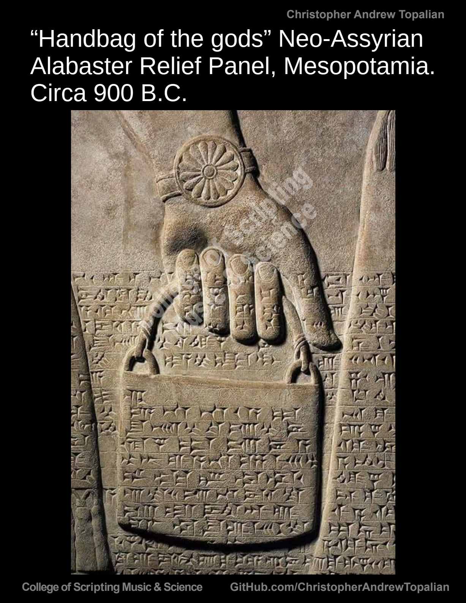

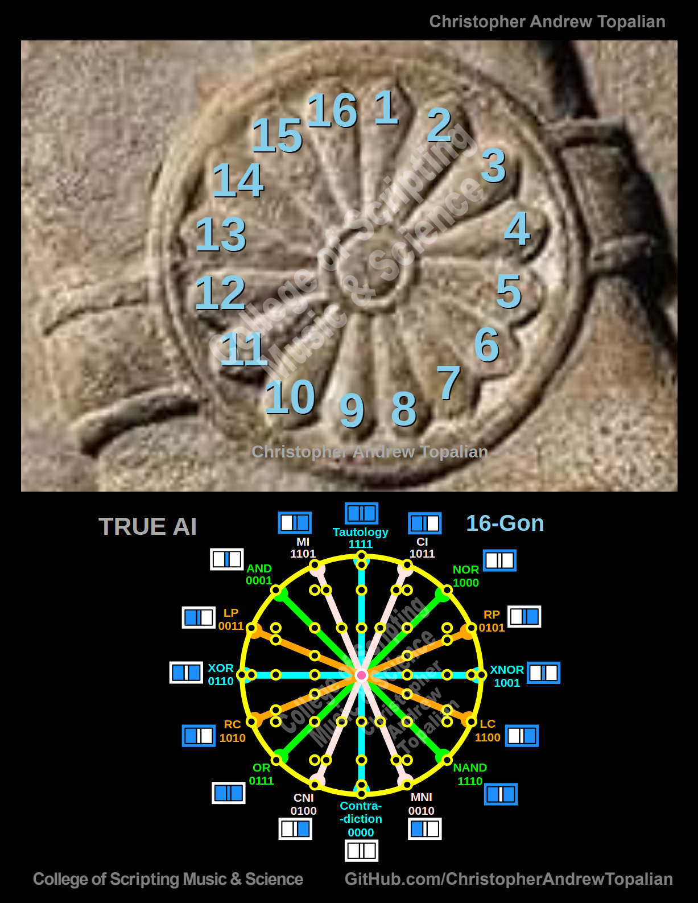

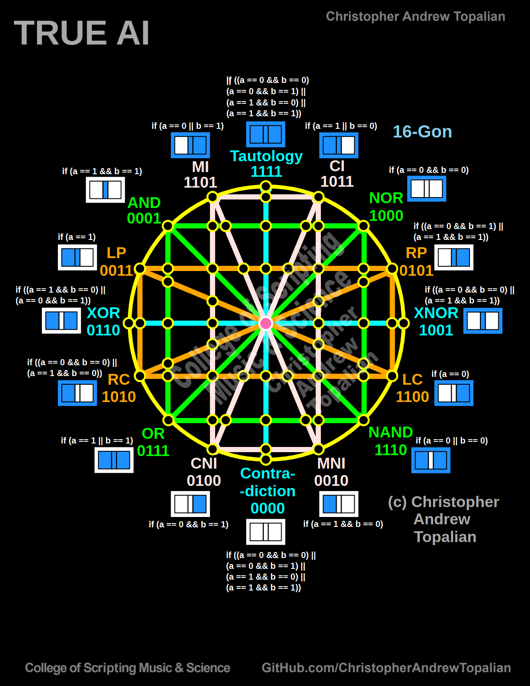

---

> ## DATE: 2025-11-12

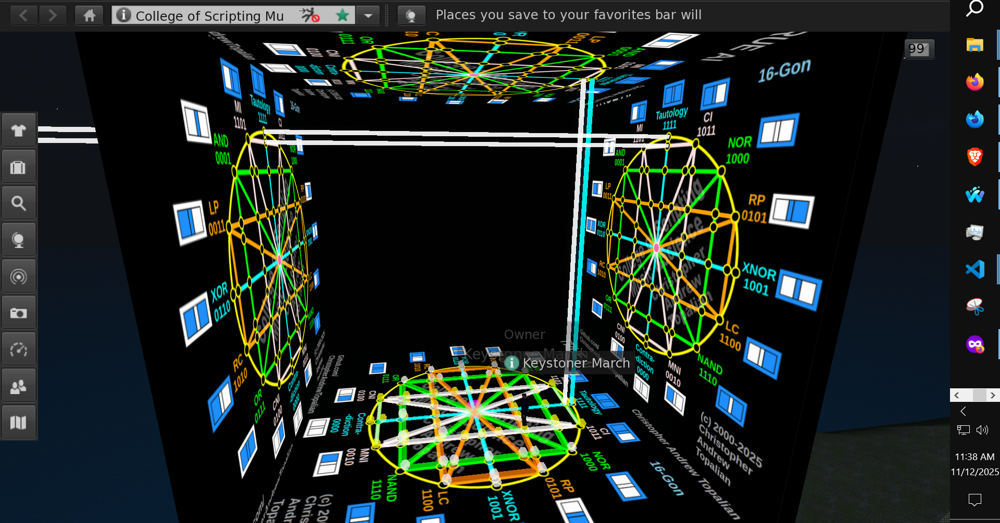

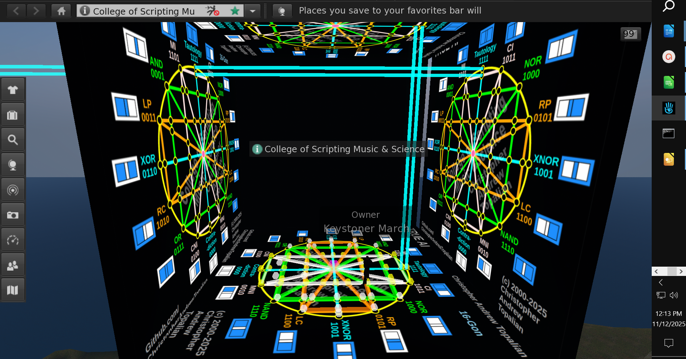

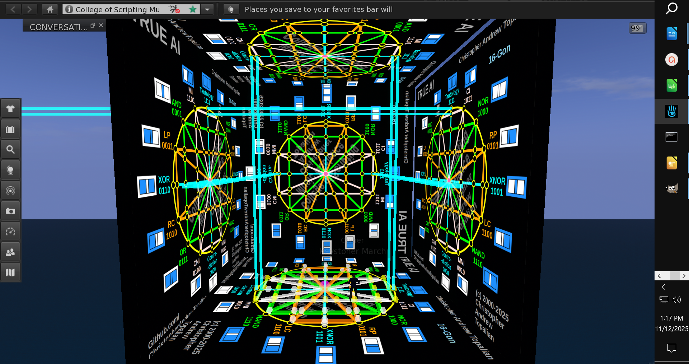

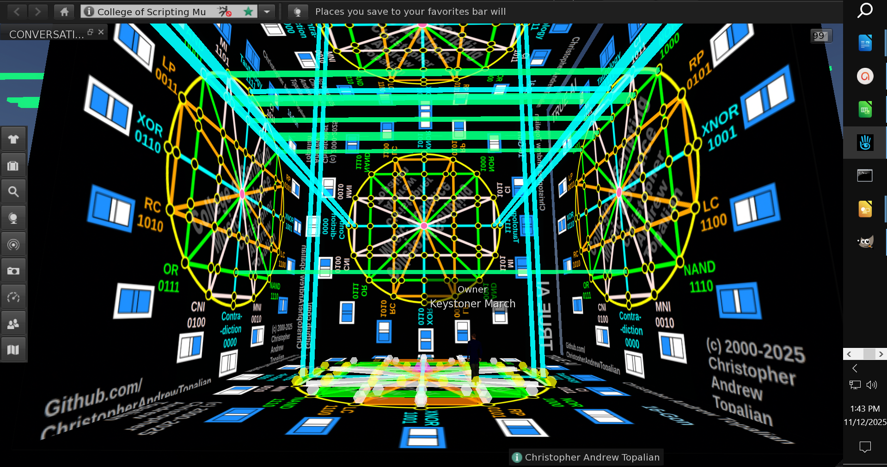

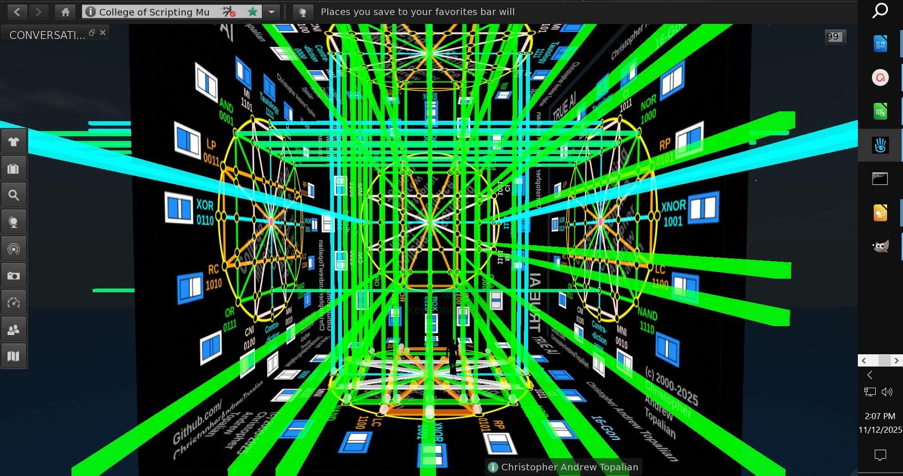

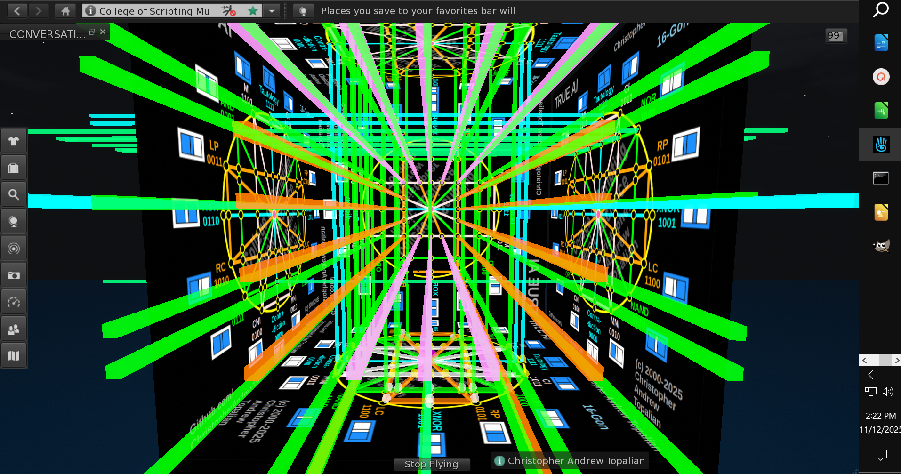

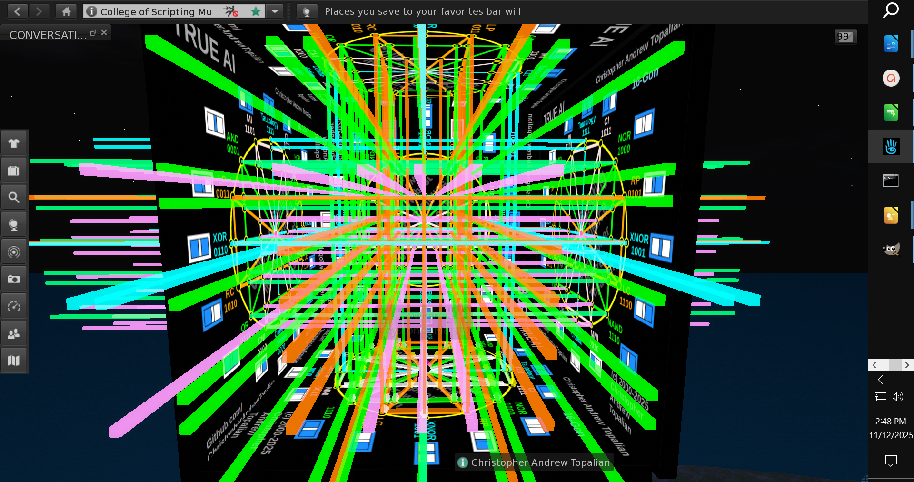

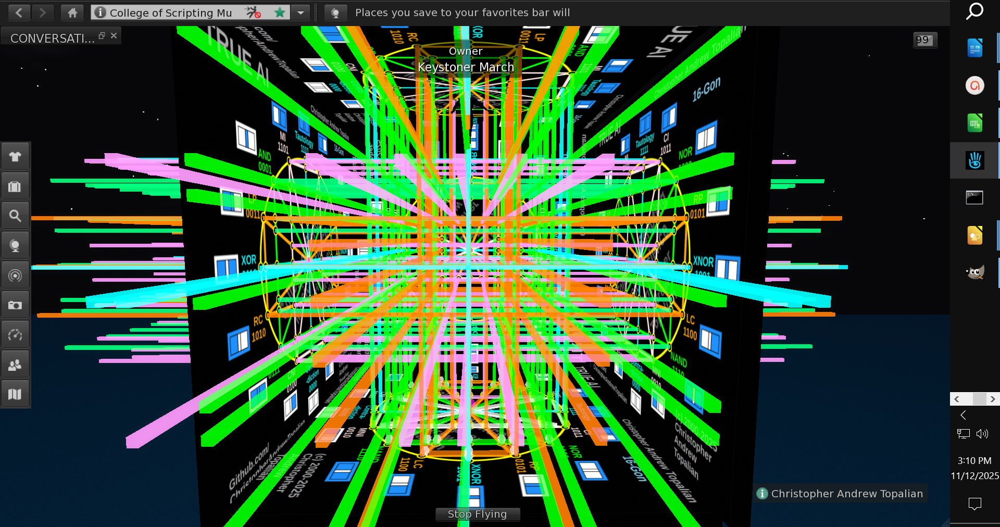

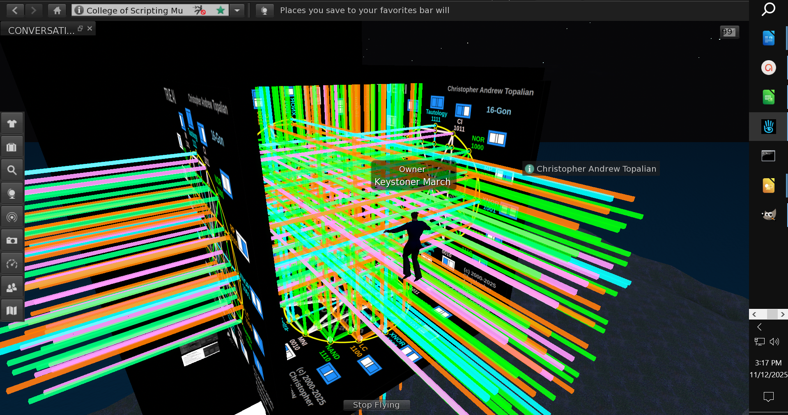

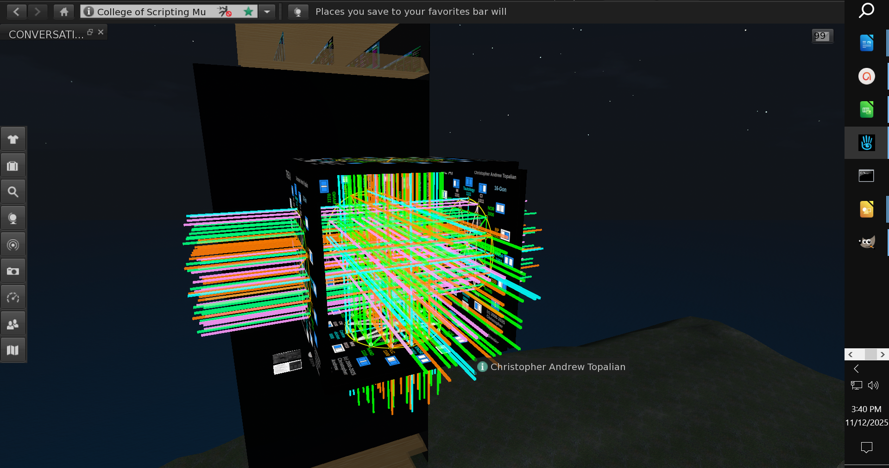

# TRUE AI 4D Hypercube Tesseract = 3 Cylinders Inside of a Cube :-)

---

> ## DATE: 2025-11-15

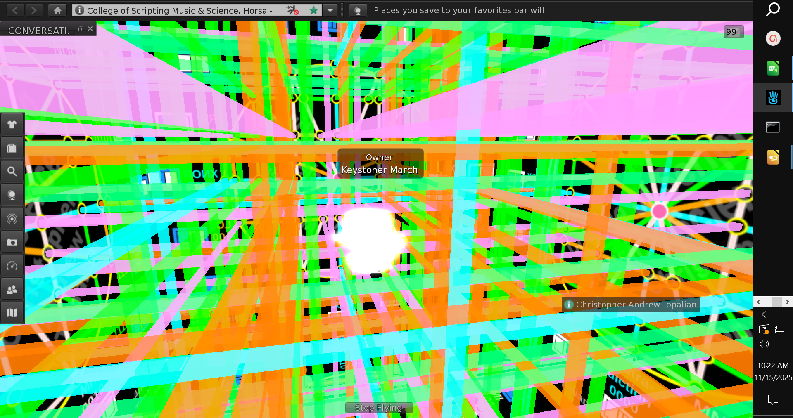

---

> ## DATE: 2025-11-19

[TRUE AI 18-gon System](src/files/2025-11-19/CATopalian_TRUE_AI_18_Gon_System.md)

---

> ## DATE: 2025-11-24

[2025-11-24-a](src/files/2025-11-24/2025-11-24-a.md)

[2025-11-24-b](src/files/2025-11-24/2025-11-24-b.md)

[2025-11-24-c](src/files/2025-11-24/2025-11-24-c.md)

---

> ## DATE: 2025-12-03

[2025-12-03-a](src/files/2025-12-03/2025-12-03-a.md)

[2025-12-03-b](src/files/2025-12-03/2025-12-03-b.md)

[2025-12-03-c](src/files/2025-12-03/2025-12-03-c.md)

[2025-12-03-d](src/files/2025-12-03/2025-12-03-d.md)

---

Video Evidence: https://www.youtube.com/watch?v=J8nDbw7VH3s

https://www.youtube.com/watch?v=Fw9i3Bg6mqk

https://www.youtube.com/watch?v=lVco9g6Y4n0

https://www.youtube.com/watch?v=88eQwWe79vc

---

How to Download this Tutorial
1. Click the green Code Button on this github page
2. Choose Download ZIP
3. Save the Zip File
4. Extract All
5. Open the LibreOffice .odg file and the .png file.

---

//----//

// Dedicated to God the Father  
// All Rights Reserved Christopher Andrew Topalian Copyright 2000-2025  
// https://github.com/ChristopherTopalian  
// https://github.com/ChristopherAndrewTopalian  
// https://sites.google.com/view/CollegeOfScripting  

