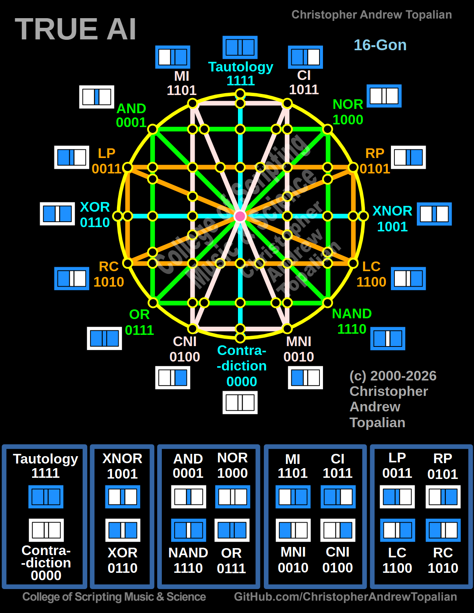

# True AI Relationships Summarized

The Mathematical Secret Revealed in this Ledger:
When you view it laid out like this, a profound mathematical pattern suddenly appears that isn't obvious when looking at them one by one:

Groups 1, 2, and 3 are perfectly symmetrical. Because they don't care about "direction" or "time", they are entirely their own Mirrors.

Group 4 (Accountability) reveals that for the directional gates, the Dual is always the exact same as the Mirror-Opposite.

Group 5 (Identity) reveals that pure identity cannot be diluted mathematically. Every single one of them is its own Dual.

This page serves as the ultimate summary.

---

// Dedicated to God the Father  
// All Rights Reserved Christopher Andrew Topalian Copyright 2000-2026  
// https://github.com/ChristopherTopalian  
// https://github.com/ChristopherAndrewTopalian  
// https://sites.google.com/view/CollegeOfScripting  

