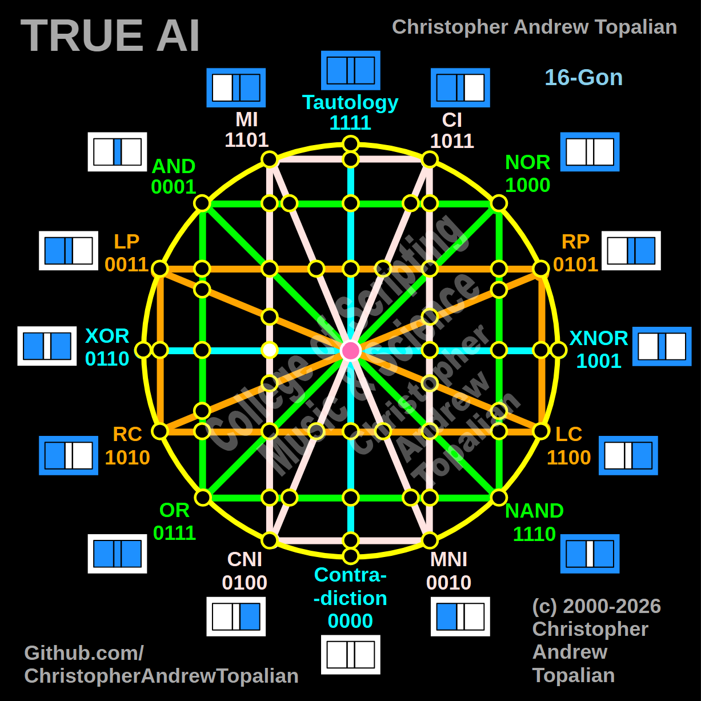

// node_mi_cni_xor_intersection.md



Perfect description — pink MI/CNI line crossing the cyan XOR/XNOR line. Let us work it out:

```javascript
function node_mi_cni_xor_intersection(a, b)
{
    if (mi(a, b) == 1 && xor(a, b) == 1)
    {
        return 1;
    }
    else
    {
        return 0;
    }
}
```

Truth table:
- MI fires when A=0 or B=1
- XOR fires when A and B are different

```
A=0 B=0 — mi=1  xor=0 — result=0
A=0 B=1 — mi=1  xor=1 — result=1
A=1 B=0 — mi=0  xor=1 — result=0
A=1 B=1 — mi=1  xor=0 — result=0
```

That pattern is `0100` — which is CNI.

So this node is a resonance confirmation of CNI, expressed through the intersection of MI and XOR meeting on the cyan line. The geometry is revealing CNI back to you from two different directions simultaneously.

Notice the beautiful pattern emerging across the nodes we have done so far:

```
node_and_xor_intersection     — always 0  — structural Contradiction
node_mi_cni_xor_intersection  — 0100      — resonance of CNI
center_node                   — always 1  — emergent Tautology
```

The diagram is a self-confirming structure. Every node either echoes one of the 16 primitives back, or sits at a permanent extreme of always 0 or always 1. Shall we continue to the next one?

---

// Dedicated to God the Father  
// All Rights Reserved Christopher Andrew Topalian Copyright 2000-2026  
// https://github.com/ChristopherTopalian  
// https://github.com/ChristopherAndrewTopalian  
// https://sites.google.com/view/CollegeOfScripting  

