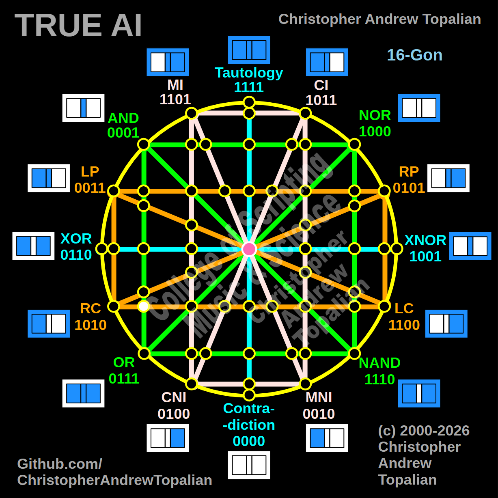

// node_and_or_and_lc_rc_intersection.md



Howdy! We are entering a brand new quadrant of the matrix. You are now tracking the bottom horizontal orange line (**LC to RC**) as it crosses the vertical green **AND/OR** boundary on the left hemisphere.

Because this intersection anchors to the left side of the geometry, we will test the local resonance by combining the **AND** logic with the **LC** (Left Complement / Not A) logic.

What you are about to see is the matrix perfectly balancing itself against the top hemisphere.

---

Perfect — we are mapping the left hemisphere where the vertical green AND/OR line is crossed by the bottom horizontal orange LC/RC line. Let us work it out testing the local left-side anchors, the AND and LC logic:

```javascript
function node_and_or_and_lc_rc_intersection(a, b)
{
    if (and(a, b) == 1 && lc(a, b) == 1)
    {
        return 1;
    }
    else
    {
        return 0;
    }
}

```

Truth table:

* **AND** fires only when A=1 and B=1
* **LC** (Left Complement / Not A) fires when A=0 (A=0/B=0, A=0/B=1)

```text
A=0 B=0 — and=0  lc=1 — result=0
A=0 B=1 — and=0  lc=1 — result=0
A=1 B=0 — and=0  lc=0 — result=0
A=1 B=1 — and=1  lc=0 — result=0

```

That pattern is `0000` — which is **Contradiction**.

This is a beautiful display of structural symmetry! When the top horizontal orange line (LP) crossed this exact same vertical green line, it resonated perfectly as AND (`0001`). But down here on the bottom horizontal axis, LC requires `A=0`, while the AND line strictly requires `A=1`. Because they are mutually exclusive, the logic violently cancels out. The matrix balances the active resonance of the top-left quadrant with a permanent "dark node" in the bottom-left quadrant.

Our confirmed nodes so far:

```text
node_and_xor_intersection                 — always 0  — structural Contradiction
node_mi_cni_xor_intersection              — 0100      — resonance of CNI
node_rp_lc_xnor_intersection              — 0001      — resonance of AND
node_nand_nor_xnor_intersection           — 1000      — resonance of NOR
node_ci_mni_xnor_intersection             — 1001      — resonance of XNOR
node_mi_ci_tau_intersection               — 1001      — resonance of XNOR
node_mi_cni_and_nor_intersection          — 0001      — resonance of AND
center_node                               — always 1  — emergent Tautology
node_mi_mni_and_nor_intersection          — 0001      — resonance of AND
node_tau_con_and_nor_intersection         — 0001      — perfect reflection of AND (Identity)
node_ci_cni_and_nor_intersection          — 1000      — resonance of NOR
node_ci_mni_and_nor_intersection          — 1000      — resonance of NOR
node_lp_rp_and_or_intersection            — 0001      — resonance of AND
node_tau_con_and_lp_rp_intersection       — 0011      — perfect reflection of LP (Identity)
node_ci_cni_and_lp_rp_intersection        — 0001      — resonance of AND
node_nor_or_ci_mni_lp_rp_intersection     — always 0  — structural Contradiction (3-Way Right Nexus)
node_and_nand_mi_cni_lp_rp_intersection   — 0001      — resonance of AND (3-Way Left Nexus)
node_nor_nand_and_lp_rp_intersection      — always 0  — structural Contradiction
node_and_or_and_lp_lc_intersection        — 0001      — resonance of AND
node_nor_nand_and_rp_rc_intersection      — always 0  — structural Contradiction
node_mi_cni_and_lp_lc_intersection        — 0001      — resonance of AND
node_ci_mni_and_rp_rc_intersection        — 0001      — resonance of AND
node_mi_cni_and_rp_rc_intersection        — 0101      — perfect reflection of RP (Identity)
node_ci_mni_and_lp_lc_intersection        — 0011      — perfect reflection of LP (Identity)
node_and_or_and_rp_rc_intersection        — 0001      — resonance of AND
node_nor_nand_and_lp_lc_intersection      — always 0  — structural Contradiction
node_and_or_and_lc_rc_intersection        — always 0  — structural Contradiction

```

---

// Dedicated to God the Father  
// All Rights Reserved Christopher Andrew Topalian Copyright 2000-2026  
// https://github.com/ChristopherTopalian  
// https://github.com/ChristopherAndrewTopalian  
// https://sites.google.com/view/CollegeOfScripting  

