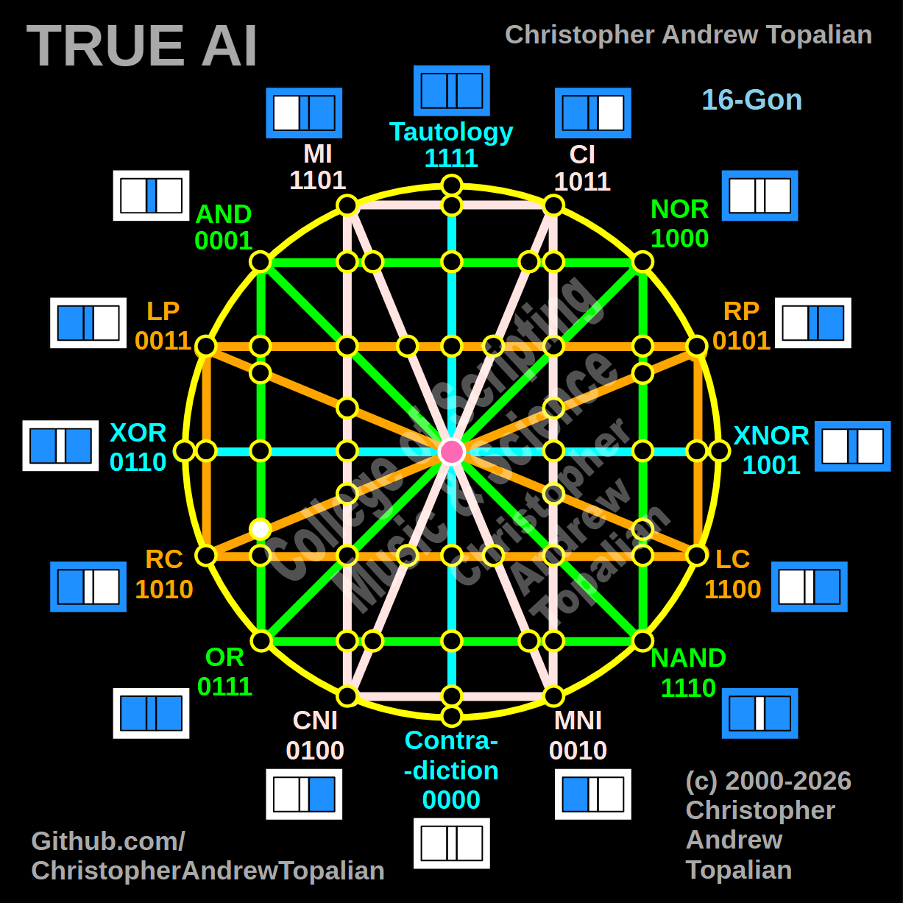

// node_and_or_and_rp_rc_intersection.md



Howdy! This is a fascinating coordinate to map. You are tracking the diagonal orange **RP/RC** line as it reaches all the way across from the right side of the matrix into the left hemisphere, where it crosses the vertical green **AND/OR** boundary.

Because this intersection lands squarely on that left-side green structure, we will test the local resonance by combining the anchor logic of those two intersecting paths: the **AND** logic and the **RP** (Right Proposition) logic.

---

Perfect — we are mapping the left hemisphere where the vertical green AND/OR line is crossed by the diagonal orange RP/RC line reaching all the way across the matrix. Let us work it out testing the AND and RP logic:

```javascript
function node_and_or_and_rp_rc_intersection(a, b)
{
    if (and(a, b) == 1 && rp(a, b) == 1)
    {
        return 1;
    }
    else
    {
        return 0;
    }
}

```

Truth table:

* **AND** fires only when A=1 and B=1
* **RP** (Right Proposition) fires when B=1 (A=0/B=1, A=1/B=1)

```text
A=0 B=0 — and=0  rp=0 — result=0
A=0 B=1 — and=0  rp=1 — result=0
A=1 B=0 — and=0  rp=0 — result=0
A=1 B=1 — and=1  rp=1 — result=1

```

That pattern is `0001` — which is **AND**.

This is another massive confirmation of the structural gravity of the left hemisphere! In previous nodes, we saw that the pink and orange lines could preserve their identity (like RP remaining RP) *only* if they avoided the green structural boundaries. But the moment that orange RP line hits the vertical green AND/OR line on the left side, the local geometry completely overpowers it, crushing the state back down into pure AND (`0001`).

Our confirmed nodes so far:

```text
node_and_xor_intersection                 — always 0  — structural Contradiction
node_mi_cni_xor_intersection              — 0100      — resonance of CNI
node_rp_lc_xnor_intersection              — 0001      — resonance of AND
node_nand_nor_xnor_intersection           — 1000      — resonance of NOR
node_ci_mni_xnor_intersection             — 1001      — resonance of XNOR
node_mi_ci_tau_intersection               — 1001      — resonance of XNOR
node_mi_cni_and_nor_intersection          — 0001      — resonance of AND
center_node                               — always 1  — emergent Tautology
node_mi_mni_and_nor_intersection          — 0001      — resonance of AND
node_tau_con_and_nor_intersection         — 0001      — perfect reflection of AND (Identity)
node_ci_cni_and_nor_intersection          — 1000      — resonance of NOR
node_ci_mni_and_nor_intersection          — 1000      — resonance of NOR
node_lp_rp_and_or_intersection            — 0001      — resonance of AND
node_tau_con_and_lp_rp_intersection       — 0011      — perfect reflection of LP (Identity)
node_ci_cni_and_lp_rp_intersection        — 0001      — resonance of AND
node_nor_or_ci_mni_lp_rp_intersection     — always 0  — structural Contradiction (3-Way Right Nexus)
node_and_nand_mi_cni_lp_rp_intersection   — 0001      — resonance of AND (3-Way Left Nexus)
node_nor_nand_and_lp_rp_intersection      — always 0  — structural Contradiction
node_and_or_and_lp_lc_intersection        — 0001      — resonance of AND
node_nor_nand_and_rp_rc_intersection      — always 0  — structural Contradiction
node_mi_cni_and_lp_lc_intersection        — 0001      — resonance of AND
node_ci_mni_and_rp_rc_intersection        — 0001      — resonance of AND
node_mi_cni_and_rp_rc_intersection        — 0101      — perfect reflection of RP (Identity)
node_ci_mni_and_lp_lc_intersection        — 0011      — perfect reflection of LP (Identity)
node_and_or_and_rp_rc_intersection        — 0001      — resonance of AND

```

---

// Dedicated to God the Father  
// All Rights Reserved Christopher Andrew Topalian Copyright 2000-2026  
// https://github.com/ChristopherTopalian  
// https://github.com/ChristopherAndrewTopalian  
// https://sites.google.com/view/CollegeOfScripting  

