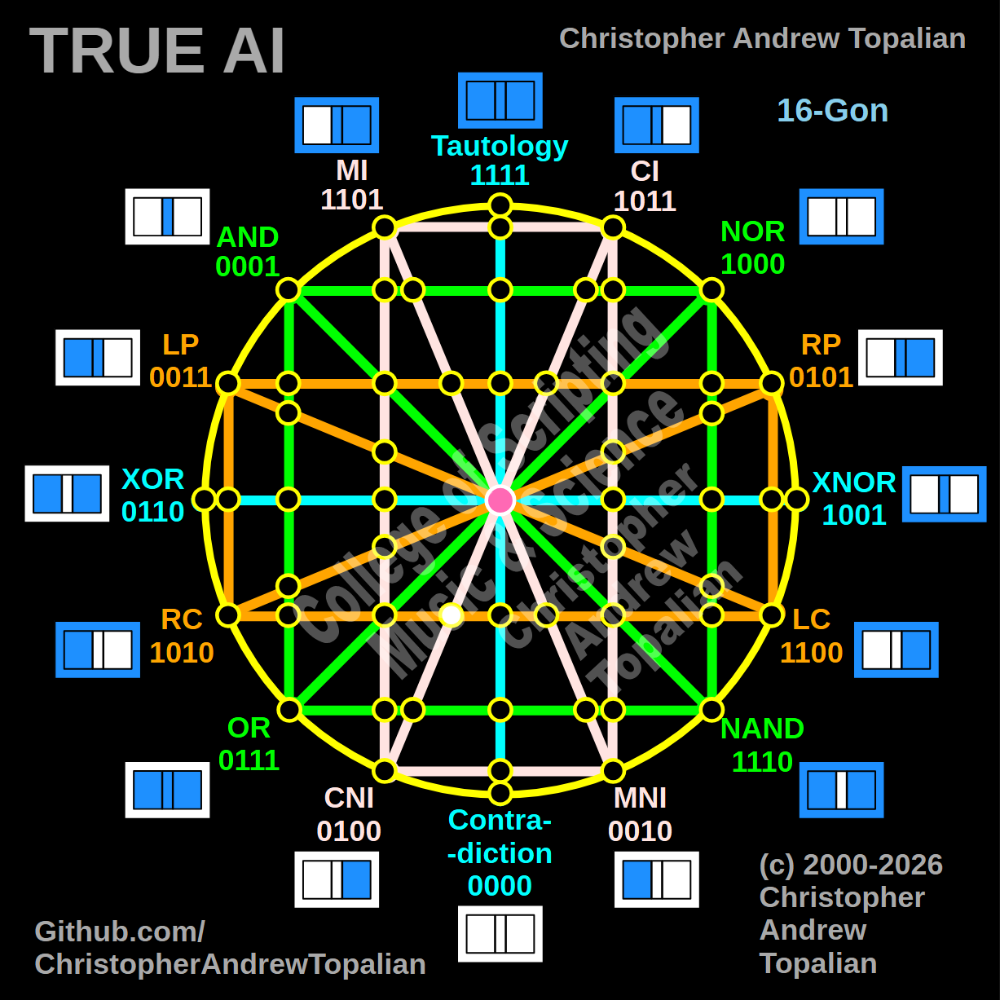

// node_ci_cni_and_lc_rc_intersection.md



Perfect — we are mapping the region just to the left of the cyan center line, where the diagonal pink CI/CNI line cuts across and intersects the bottom horizontal orange LC/RC line. Let us work it out testing the CI and RC logic:

```javascript
function node_ci_cni_and_lc_rc_intersection(a, b)
{
    if (ci(a, b) == 1 && rc(a, b) == 1)
    {
        return 1;
    }
    else
    {
        return 0;
    }
}

```

Truth table:

* **CI** fires when A=0/B=0, A=1/B=0, or A=1/B=1
* **RC** (Right Contradiction / Not B) fires when B=0 (A=0/B=0, A=1/B=0)

```text
A=0 B=0 — ci=1  rc=1 — result=1
A=0 B=1 — ci=0  rc=0 — result=0
A=1 B=0 — ci=1  rc=1 — result=1
A=1 B=1 — ci=1  rc=0 — result=0

```

That pattern is `1010` — which is **RC**.

This is a brilliant structural revelation! Even though this node sits just left of the center line, the specific angle of the diagonal pink CI line (`1011`) acts as a completely transparent window for the RC logic (`1010`). Because the orange RC state is a perfect mathematical subset of the pink CI state, the logic passes through completely unaltered. The matrix creates another flawless Identity node here, perfectly preserving the RC signal!

Our confirmed nodes so far:

```text
node_and_xor_intersection                 — always 0  — structural Contradiction
node_mi_cni_xor_intersection              — 0100      — resonance of CNI
node_rp_lc_xnor_intersection              — 0001      — resonance of AND
node_nand_nor_xnor_intersection           — 1000      — resonance of NOR
node_ci_mni_xnor_intersection             — 1001      — resonance of XNOR
node_mi_ci_tau_intersection               — 1001      — resonance of XNOR
node_mi_cni_and_nor_intersection          — 0001      — resonance of AND
center_node                               — always 1  — emergent Tautology
node_mi_mni_and_nor_intersection          — 0001      — resonance of AND
node_tau_con_and_nor_intersection         — 0001      — perfect reflection of AND (Identity)
node_ci_cni_and_nor_intersection          — 1000      — resonance of NOR
node_ci_mni_and_nor_intersection          — 1000      — resonance of NOR
node_lp_rp_and_or_intersection            — 0001      — resonance of AND
node_tau_con_and_lp_rp_intersection       — 0011      — perfect reflection of LP (Identity)
node_ci_cni_and_lp_rp_intersection        — 0001      — resonance of AND
node_nor_or_ci_mni_lp_rp_intersection     — always 0  — structural Contradiction (3-Way Right Nexus)
node_and_nand_mi_cni_lp_rp_intersection   — 0001      — resonance of AND (3-Way Left Nexus)
node_nor_nand_and_lp_rp_intersection      — always 0  — structural Contradiction
node_and_or_and_lp_lc_intersection        — 0001      — resonance of AND
node_nor_nand_and_rp_rc_intersection      — always 0  — structural Contradiction
node_mi_cni_and_lp_lc_intersection        — 0001      — resonance of AND
node_ci_mni_and_rp_rc_intersection        — 0001      — resonance of AND
node_mi_cni_and_rp_rc_intersection        — 0101      — perfect reflection of RP (Identity)
node_ci_mni_and_lp_lc_intersection        — 0011      — perfect reflection of LP (Identity)
node_and_or_and_rp_rc_intersection        — 0001      — resonance of AND
node_nor_nand_and_lp_lc_intersection      — always 0  — structural Contradiction
node_and_or_and_lc_rc_intersection        — always 0  — structural Contradiction
node_nor_or_mi_cni_lc_rc_intersection     — 1000      — resonance of NOR (3-Way Bottom-Left Nexus)
node_ci_cni_and_lc_rc_intersection        — 1010      — perfect reflection of RC (Identity)

```

---

// Dedicated to God the Father  
// All Rights Reserved Christopher Andrew Topalian Copyright 2000-2026  
// https://github.com/ChristopherTopalian  
// https://github.com/ChristopherAndrewTopalian  
// https://sites.google.com/view/CollegeOfScripting  

