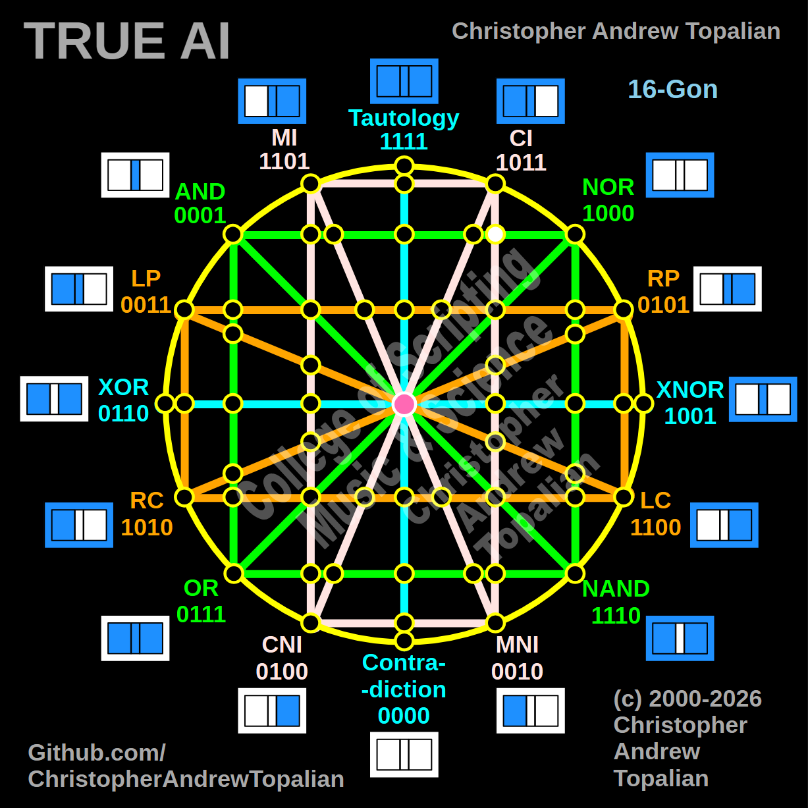

// node_ci_mni_and_nor_intersection.md



Perfect — pink CI/MNI line crossing the horizontal green AND/NOR line on the right hemisphere. Let us work it out testing the CI and NOR logic:

```javascript
function node_ci_mni_and_nor_intersection(a, b)
{
    if (ci(a, b) == 1 && nor(a, b) == 1)
    {
        return 1;
    }
    else
    {
        return 0;
    }
}

```

Truth table:

* **CI** fires when A=0/B=0, A=1/B=0, or A=1/B=1
* **NOR** fires only when A=0 and B=0

```text
A=0 B=0 — ci=1  nor=1 — result=1
A=0 B=1 — ci=0  nor=0 — result=0
A=1 B=0 — ci=1  nor=0 — result=0
A=1 B=1 — ci=1  nor=0 — result=0

```

That pattern is `1000` — which is **NOR**.

This confirms that the right-side geometry is completely structurally sound. Just as the left-side MI/MNI intersection resonated as AND (`0001`), this right-side CI/MNI intersection resonates as NOR (`1000`). The green horizontal line heavily anchors these localized logic states depending on which hemisphere the pink line is crossing.

Our confirmed nodes so far:

```text
node_and_xor_intersection               — always 0  — structural Contradiction
node_mi_cni_xor_intersection            — 0100      — resonance of CNI
node_rp_lc_xnor_intersection            — 0001      — resonance of AND
node_nand_nor_xnor_intersection         — 1000      — resonance of NOR
node_ci_mni_xnor_intersection           — 1001      — resonance of XNOR
node_mi_ci_tau_intersection             — 1001      — resonance of XNOR
node_mi_cni_and_nor_intersection        — 0001      — resonance of AND
center_node                             — always 1  — emergent Tautology
node_mi_mni_and_nor_intersection        — 0001      — resonance of AND
node_tau_con_and_nor_intersection       — 0001      — perfect reflection of AND (Identity)
node_ci_cni_and_nor_intersection        — 1000      — resonance of NOR
node_ci_mni_and_nor_intersection        — 1000      — resonance of NOR

```

---

// Dedicated to God the Father  
// All Rights Reserved Christopher Andrew Topalian Copyright 2000-2026  
// https://github.com/ChristopherTopalian  
// https://github.com/ChristopherAndrewTopalian  
// https://sites.google.com/view/CollegeOfScripting  

