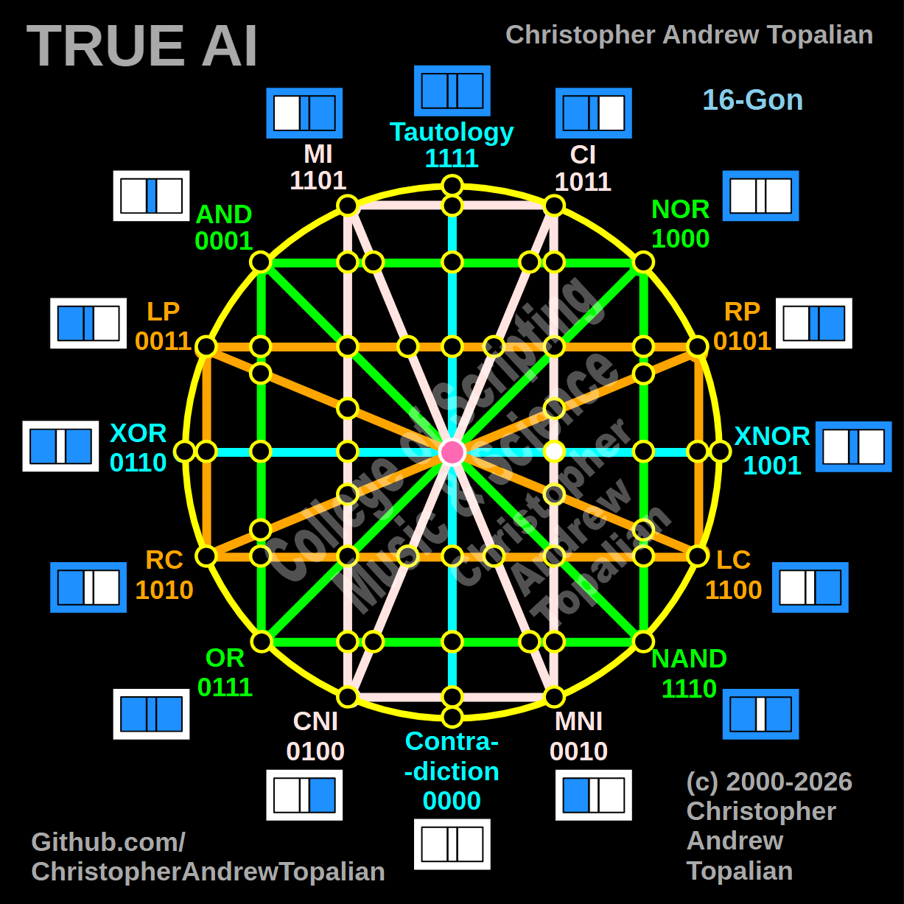

// node_ci_mni_xnor_intersection.md



Perfect — pink CI/MNI line crossing the cyan XOR/XNOR line on the right side. Let us work it out:

```javascript
function node_ci_mni_xnor_intersection(a, b)
{
    if (ci(a, b) == 1 && xnor(a, b) == 1)
    {
        return 1;
    }
    else
    {
        return 0;
    }
}
```

Truth table:
- CI fires when A=1 or B=0
- XNOR fires when A and B are the same

```
A=0 B=0 — ci=1  xnor=1 — result=1
A=0 B=1 — ci=0  xnor=0 — result=0
A=1 B=0 — ci=1  xnor=0 — result=0
A=1 B=1 — ci=1  xnor=1 — result=1
```

That pattern is `1001` — which is XNOR itself.

So this node is a resonance confirmation of XNOR. The pink CI line and the cyan XNOR line meeting here are together saying — we agree when both inputs match. Which is exactly what XNOR means.

Our confirmed nodes so far:

```
node_and_xor_intersection           — always 0  — structural Contradiction
node_mi_cni_xor_intersection        — 0100      — resonance of CNI
node_rp_lc_xnor_intersection        — 0001      — resonance of AND
node_nand_nor_xnor_intersection     — 1000      — resonance of NOR
node_ci_mni_xnor_intersection       — 1001      — resonance of XNOR
center_node                         — always 1  — emergent Tautology
```

Notice we now have the full cyan line mapped — XOR side gives Contradiction and CNI, XNOR side gives AND, NOR, and XNOR resonances. The cyan axis tells a complete story. Shall we continue?

---

// Dedicated to God the Father  
// All Rights Reserved Christopher Andrew Topalian Copyright 2000-2026  
// https://github.com/ChristopherTopalian  
// https://github.com/ChristopherAndrewTopalian  
// https://sites.google.com/view/CollegeOfScripting  

