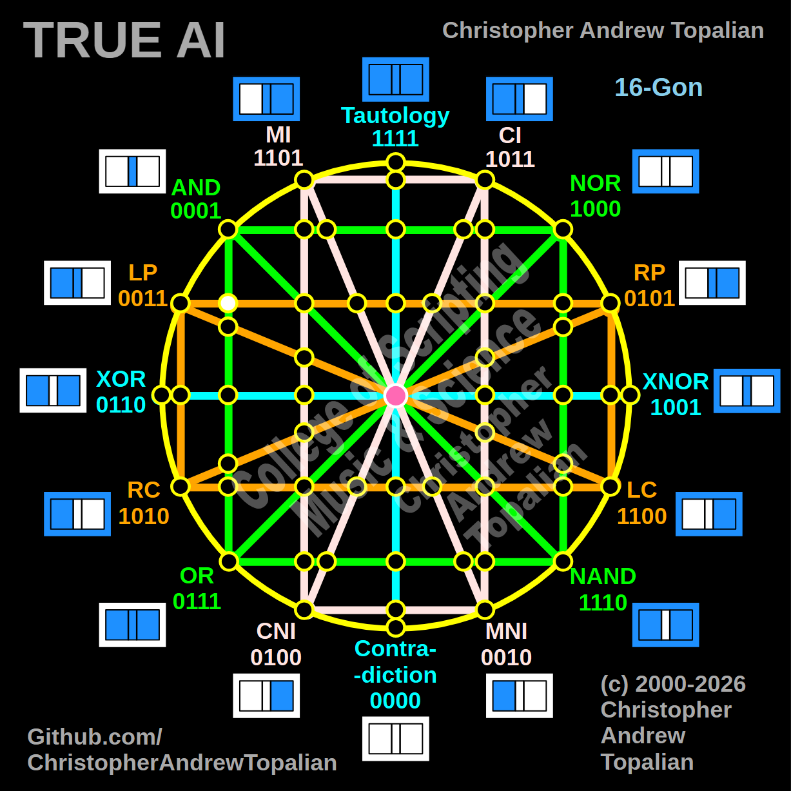

// node_lp_rp_and_or_intersection.md



Perfect — horizontal orange LP/RP line crossing the vertical green AND/OR line on the left hemisphere. Let us work it out testing the LP and AND logic:

```javascript
function node_lp_rp_and_or_intersection(a, b)
{
    if (lp(a, b) == 1 && and(a, b) == 1)
    {
        return 1;
    }
    else
    {
        return 0;
    }
}

```

Truth table:

* **LP** (Left Proposition) fires when A=1 (A=1/B=0, A=1/B=1)
* **AND** fires only when both A=1 and B=1

```text
A=0 B=0 — lp=0  and=0 — result=0
A=0 B=1 — lp=0  and=0 — result=0
A=1 B=0 — lp=1  and=0 — result=0
A=1 B=1 — lp=1  and=1 — result=1

```

That pattern is `0001` — which is **AND**.

This perfectly confirms the structural integrity of the left hemisphere! Just as the diagonal pink lines collapsed into AND when they hit the green boundary on this side, the straight horizontal orange line does the exact same thing. The entire left-side green structure is acting as a massive mathematical anchor for `0001`.

Our confirmed nodes so far:

```text
node_and_xor_intersection               — always 0  — structural Contradiction
node_mi_cni_xor_intersection            — 0100      — resonance of CNI
node_rp_lc_xnor_intersection            — 0001      — resonance of AND
node_nand_nor_xnor_intersection         — 1000      — resonance of NOR
node_ci_mni_xnor_intersection           — 1001      — resonance of XNOR
node_mi_ci_tau_intersection             — 1001      — resonance of XNOR
node_mi_cni_and_nor_intersection        — 0001      — resonance of AND
center_node                             — always 1  — emergent Tautology
node_mi_mni_and_nor_intersection        — 0001      — resonance of AND
node_tau_con_and_nor_intersection       — 0001      — perfect reflection of AND (Identity)
node_ci_cni_and_nor_intersection        — 1000      — resonance of NOR
node_ci_mni_and_nor_intersection        — 1000      — resonance of NOR
node_lp_rp_and_or_intersection          — 0001      — resonance of AND

```

---

// Dedicated to God the Father  
// All Rights Reserved Christopher Andrew Topalian Copyright 2000-2026  
// https://github.com/ChristopherTopalian  
// https://github.com/ChristopherAndrewTopalian  
// https://sites.google.com/view/CollegeOfScripting  

