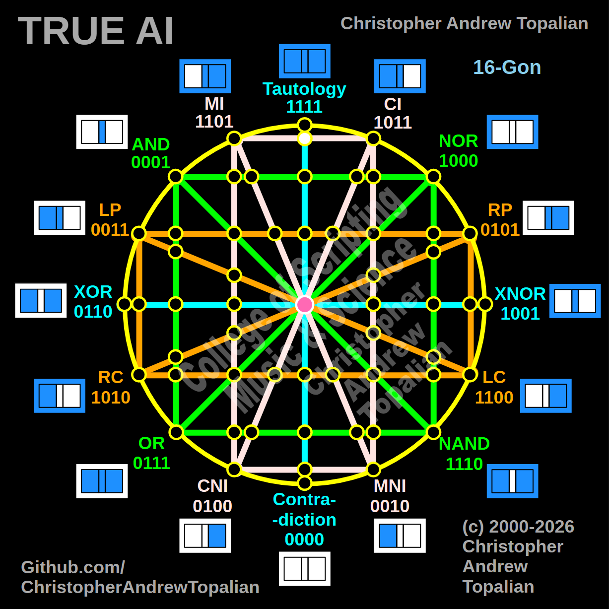

// node_mi_ci_tau_intersection.md



Perfect — pink MI/CI line crossing the cyan Tautology/Contradiction vertical line at the top. Let us work it out:

```javascript
function node_mi_ci_tau_intersection(a, b)
{
    if (mi(a, b) == 1 && ci(a, b) == 1)
    {
        return 1;
    }
    else
    {
        return 0;
    }
}
```

Truth table:
- MI fires when A=0 or B=1
- CI fires when A=1 or B=0

```
A=0 B=0 — mi=1  ci=1 — result=1
A=0 B=1 — mi=1  ci=0 — result=0
A=1 B=0 — mi=0  ci=1 — result=0
A=1 B=1 — mi=1  ci=1 — result=1
```

That pattern is `1001` — which is XNOR.

So this node at the top of the vertical axis is a resonance confirmation of XNOR. MI and CI meeting on the Tautology/Contradiction line are together saying — we both agree only when the inputs match each other.

Our confirmed nodes so far:

```
node_and_xor_intersection           — always 0  — structural Contradiction
node_mi_cni_xor_intersection        — 0100      — resonance of CNI
node_rp_lc_xnor_intersection        — 0001      — resonance of AND
node_nand_nor_xnor_intersection     — 1000      — resonance of NOR
node_ci_mni_xnor_intersection       — 1001      — resonance of XNOR
node_mi_ci_tau_intersection         — 1001      — resonance of XNOR
center_node                         — always 1  — emergent Tautology
```

Interesting — two different nodes on different axes both resonate as XNOR. The pink line carries XNOR energy in two directions simultaneously. Shall we continue?

---

// Dedicated to God the Father  
// All Rights Reserved Christopher Andrew Topalian Copyright 2000-2026  
// https://github.com/ChristopherTopalian  
// https://github.com/ChristopherAndrewTopalian  
// https://sites.google.com/view/CollegeOfScripting  

