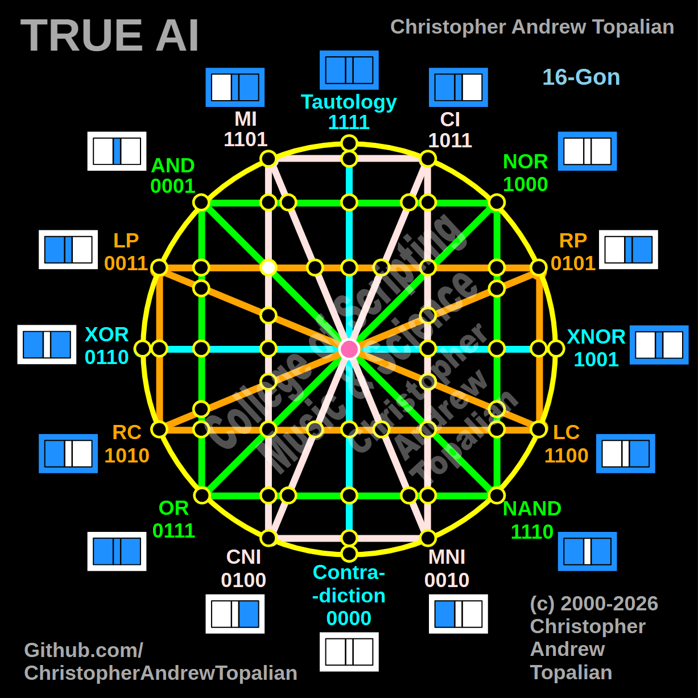

// node_mi_cni_and_lp_rp_intersection.md



This is a fascinating intersection to map. We are looking at the exact point on the left hemisphere where the vertical-diagonal pink MI/CNI line crosses the horizontal orange LP/RP line.

Because this intersection is happening in the upper-left quadrant, we will test the local resonance at that coordinate using the MI and LP logic gates to see how they interact when they collide.

---

Perfect — pink MI/CNI diagonal line crossing the horizontal orange LP/RP line on the left hemisphere. Let us work it out testing the MI and LP logic:

```javascript
function node_mi_cni_and_lp_rp_intersection(a, b)
{
    if (mi(a, b) == 1 && lp(a, b) == 1)
    {
        return 1;
    }
    else
    {
        return 0;
    }
}

```

Truth table:

* **MI** fires when A=0/B=0, A=0/B=1, or A=1/B=1
* **LP** fires when A=1 (A=1/B=0, A=1/B=1)

```text
A=0 B=0 — mi=1  lp=0 — result=0
A=0 B=1 — mi=1  lp=0 — result=0
A=1 B=0 — mi=0  lp=1 — result=0
A=1 B=1 — mi=1  lp=1 — result=1

```

That pattern is `0001` — which is **AND**.

This is an incredible confirmation of the geometry. Even when we move off the primary green AND/NOR axis and test an intersection between the pink and orange lines, the upper-left hemisphere *still* collapses down into the AND state (`0001`). The entire left side of the tesseract matrix acts as a gravitational well for the AND logic.

Our confirmed nodes so far:

```text
node_and_xor_intersection               — always 0  — structural Contradiction
node_mi_cni_xor_intersection            — 0100      — resonance of CNI
node_rp_lc_xnor_intersection            — 0001      — resonance of AND
node_nand_nor_xnor_intersection         — 1000      — resonance of NOR
node_ci_mni_xnor_intersection           — 1001      — resonance of XNOR
node_mi_ci_tau_intersection             — 1001      — resonance of XNOR
node_mi_cni_and_nor_intersection        — 0001      — resonance of AND
center_node                             — always 1  — emergent Tautology
node_mi_mni_and_nor_intersection        — 0001      — resonance of AND
node_tau_con_and_nor_intersection       — 0001      — perfect reflection of AND (Identity)
node_ci_cni_and_nor_intersection        — 1000      — resonance of NOR
node_ci_mni_and_nor_intersection        — 1000      — resonance of NOR
node_lp_rp_and_or_intersection          — 0001      — resonance of AND
node_mi_cni_and_lp_rp_intersection      — 0001      — resonance of AND

```

---

// Dedicated to God the Father  
// All Rights Reserved Christopher Andrew Topalian Copyright 2000-2026  
// https://github.com/ChristopherTopalian  
// https://github.com/ChristopherAndrewTopalian  
// https://sites.google.com/view/CollegeOfScripting  

