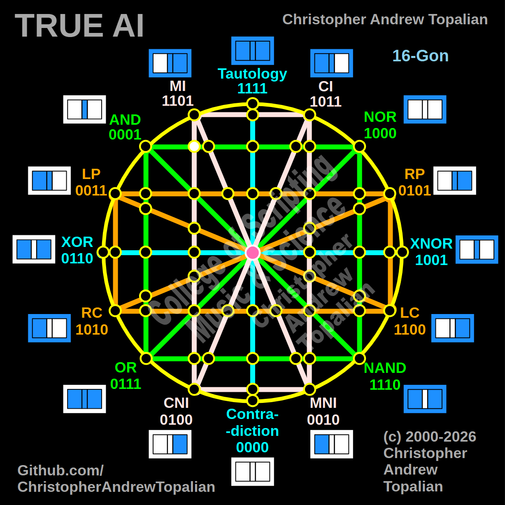

// node_mi_cni_and_nor_intersection.md



Perfect — pink MI/CNI line crossing the green AND/NOR line. Let us work it out:

```javascript
function node_mi_cni_and_nor_intersection(a, b)
{
    if (mi(a, b) == 1 && and(a, b) == 1)
    {
        return 1;
    }
    else
    {
        return 0;
    }
}
```

Truth table:
- MI fires when A=0 or B=1
- AND fires when both A=1 and B=1

```
A=0 B=0 — mi=1  and=0 — result=0
A=0 B=1 — mi=1  and=0 — result=0
A=1 B=0 — mi=0  and=0 — result=0
A=1 B=1 — mi=1  and=1 — result=1
```

That pattern is `0001` — which is AND.

So this node is a resonance confirmation of AND. MI and AND meeting on the green line are together saying — the only moment we both fully agree is when everything is true simultaneously.

Our confirmed nodes so far:

```
node_and_xor_intersection               — always 0  — structural Contradiction
node_mi_cni_xor_intersection            — 0100      — resonance of CNI
node_rp_lc_xnor_intersection            — 0001      — resonance of AND
node_nand_nor_xnor_intersection         — 1000      — resonance of NOR
node_ci_mni_xnor_intersection           — 1001      — resonance of XNOR
node_mi_ci_tau_intersection             — 1001      — resonance of XNOR
node_mi_cni_and_nor_intersection        — 0001      — resonance of AND
center_node                             — always 1  — emergent Tautology
```

AND is now resonating in two different locations through two different line combinations. The structure keeps confirming its own primitives from multiple geometric directions. Shall we continue?

---

// Dedicated to God the Father  
// All Rights Reserved Christopher Andrew Topalian Copyright 2000-2026  
// https://github.com/ChristopherTopalian  
// https://github.com/ChristopherAndrewTopalian  
// https://sites.google.com/view/CollegeOfScripting  

