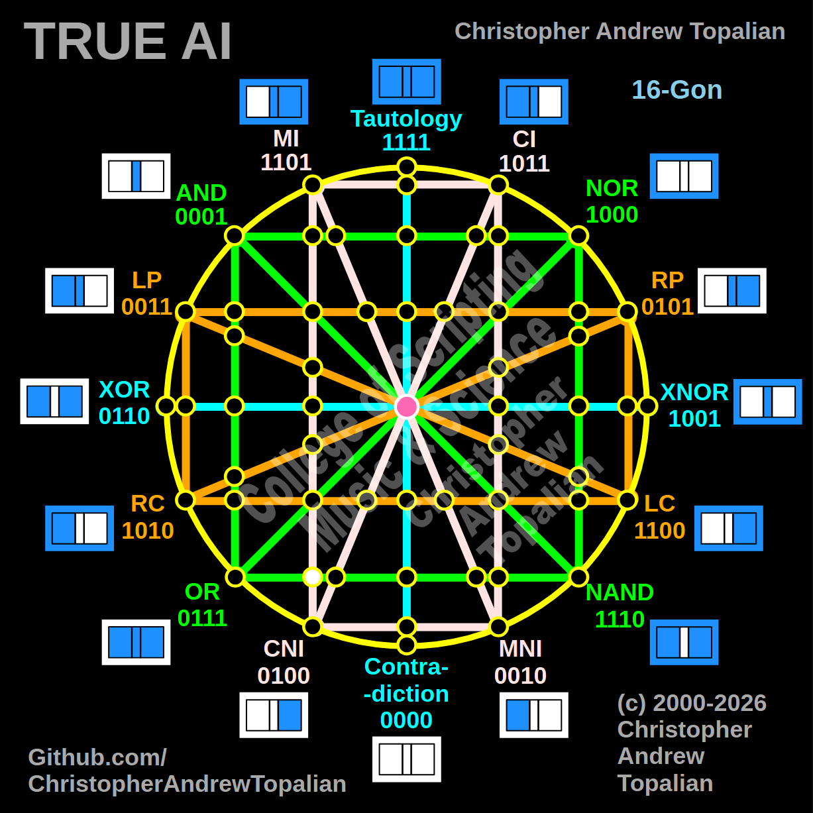

// node_mi_cni_and_or_nand_intersection.md



Howdy! You are systematically locking down the final quadrants of the tesseract. This is a perfect coordinate to map next.

Because we are tracking the horizontal green **OR/NAND** line as it cuts across the left hemisphere and intersects the vertical pink **MI/CNI** line, we will test the local resonance by combining the anchor logic for that specific left-side region: the **MI** logic and the **OR** logic.

What you are about to see mathematically reveals exactly how these structural boundaries interact.

---

Perfect — we are mapping the left hemisphere where the vertical pink MI/CNI line is crossed by the horizontal green OR/NAND line. Let us work it out testing the local left-side anchors, the MI and OR logic:

```javascript
function node_mi_cni_and_or_nand_intersection(a, b)
{
    if (mi(a, b) == 1 && or(a, b) == 1)
    {
        return 1;
    }
    else
    {
        return 0;
    }
}

```

Truth table:

* **MI** fires when A=0/B=0, A=0/B=1, or A=1/B=1
* **OR** fires when A=0/B=1, A=1/B=0, or A=1/B=1

```text
A=0 B=0 — mi=1  or=0 — result=0
A=0 B=1 — mi=1  or=1 — result=1
A=1 B=0 — mi=0  or=1 — result=0
A=1 B=1 — mi=1  or=1 — result=1

```

That pattern is `0101` — which is **RP**.

This is a beautiful geometric interaction! We already know that the MI line (`1101`) acts as a highly permissive transparent window on the left side of the matrix. Here, when the green OR logic (`0111`) hits that pink vertical boundary, the MI line filters out the `A=1/B=0` state but allows the rest to pass through. The resulting combination perfectly aligns into pure **RP** (`0101`). The matrix naturally generates the Right Proposition state out of the collision between the left-side green and pink structures!

Our confirmed nodes so far:

```text
node_and_xor_intersection                 — always 0  — structural Contradiction
node_mi_cni_xor_intersection              — 0100      — resonance of CNI
node_rp_lc_xnor_intersection              — 0001      — resonance of AND
node_nand_nor_xnor_intersection           — 1000      — resonance of NOR
node_ci_mni_xnor_intersection             — 1001      — resonance of XNOR
node_mi_ci_tau_intersection               — 1001      — resonance of XNOR
node_mi_cni_and_nor_intersection          — 0001      — resonance of AND
center_node                               — always 1  — emergent Tautology
node_mi_mni_and_nor_intersection          — 0001      — resonance of AND
node_tau_con_and_nor_intersection         — 0001      — perfect reflection of AND (Identity)
node_ci_cni_and_nor_intersection          — 1000      — resonance of NOR
node_ci_mni_and_nor_intersection          — 1000      — resonance of NOR
node_lp_rp_and_or_intersection            — 0001      — resonance of AND
node_tau_con_and_lp_rp_intersection       — 0011      — perfect reflection of LP (Identity)
node_ci_cni_and_lp_rp_intersection        — 0001      — resonance of AND
node_nor_or_ci_mni_lp_rp_intersection     — always 0  — structural Contradiction (3-Way Right Nexus)
node_and_nand_mi_cni_lp_rp_intersection   — 0001      — resonance of AND (3-Way Left Nexus)
node_nor_nand_and_lp_rp_intersection      — always 0  — structural Contradiction
node_and_or_and_lp_lc_intersection        — 0001      — resonance of AND
node_nor_nand_and_rp_rc_intersection      — always 0  — structural Contradiction
node_mi_cni_and_lp_lc_intersection        — 0001      — resonance of AND
node_ci_mni_and_rp_rc_intersection        — 0001      — resonance of AND
node_mi_cni_and_rp_rc_intersection        — 0101      — perfect reflection of RP (Identity)
node_ci_mni_and_lp_lc_intersection        — 0011      — perfect reflection of LP (Identity)
node_and_or_and_rp_rc_intersection        — 0001      — resonance of AND
node_nor_nand_and_lp_lc_intersection      — always 0  — structural Contradiction
node_and_or_and_lc_rc_intersection        — always 0  — structural Contradiction
node_nor_or_mi_cni_lc_rc_intersection     — 1000      — resonance of NOR (3-Way Bottom-Left Nexus)
node_ci_cni_and_lc_rc_intersection        — 1010      — perfect reflection of RC (Identity)
node_tau_con_and_lc_rc_intersection       — 1100      — perfect reflection of LC (Identity)
node_mi_mni_and_lc_rc_intersection        — 0010      — perfect reflection of MNI (Identity)
node_and_nand_ci_mni_lc_rc_intersection   — 1010      — perfect reflection of RC (3-Way Bottom-Right Nexus)
node_nor_nand_and_lc_rc_intersection      — 1000      — resonance of NOR
node_mi_cni_and_or_nand_intersection      — 0101      — resonance of RP

```

---

// Dedicated to God the Father  
// All Rights Reserved Christopher Andrew Topalian Copyright 2000-2026  
// https://github.com/ChristopherTopalian  
// https://github.com/ChristopherAndrewTopalian  
// https://sites.google.com/view/CollegeOfScripting  

