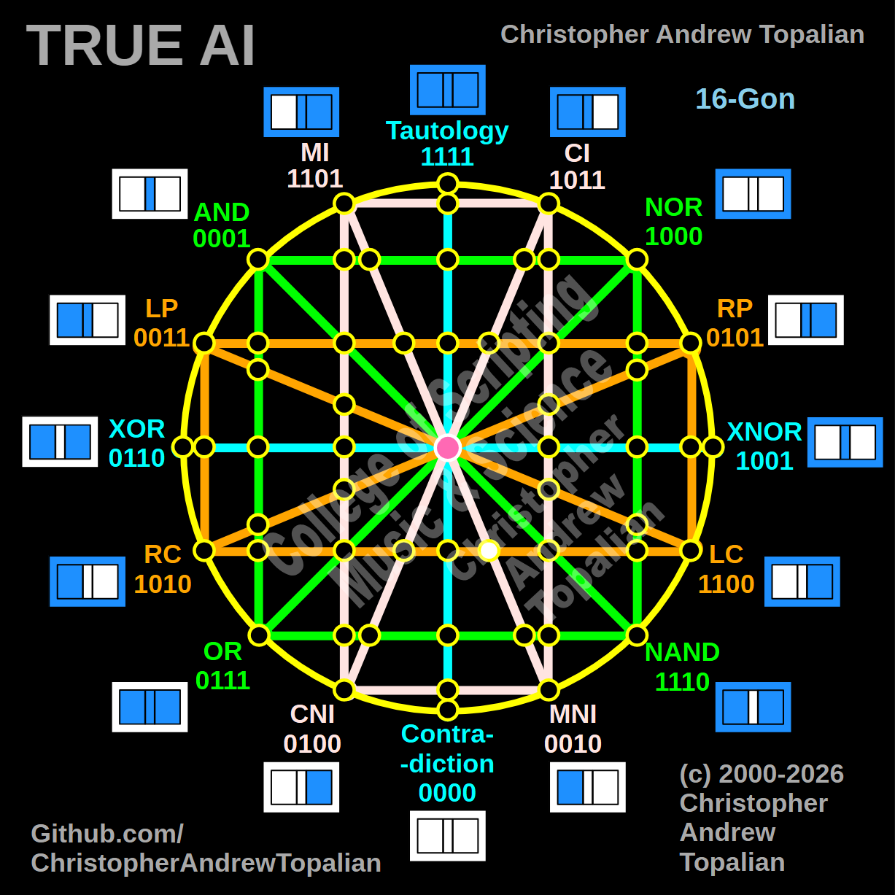

// node_mi_mni_and_lc_rc_intersection.md



Howdy! This is a fantastic coordinate to map, and it sits perfectly in sequence with our last few discoveries.

Because we just mapped the exact center of that bottom horizontal orange **LC/RC** line, tracking this next node tells us exactly what happens when we take one step to the *right* of the cyan center line. We are now looking at the region where the diagonal pink **MI/MNI** line cuts across and intersects that horizontal orange boundary.

Since this intersection occurs on the right hemisphere of the geometry (approaching the bottom-right MNI anchor), we will test the local resonance by combining the **MNI** logic and the **RC** (Right Contradiction) logic.

---

Perfect — we are mapping the region just to the right of the cyan center line, where the diagonal pink MI/MNI line intersects the bottom horizontal orange LC/RC line. Let us work it out testing the local right-side anchors, the MNI and RC logic:

```javascript
function node_mi_mni_and_lc_rc_intersection(a, b)
{
    if (mni(a, b) == 1 && rc(a, b) == 1)
    {
        return 1;
    }
    else
    {
        return 0;
    }
}

```

Truth table:

* **MNI** (Material Non-Implication) fires only when A=1 and B=0
* **RC** (Right Contradiction / Not B) fires when B=0 (A=0/B=0, A=1/B=0)

```text
A=0 B=0 — mni=0  rc=1 — result=0
A=0 B=1 — mni=0  rc=0 — result=0
A=1 B=0 — mni=1  rc=1 — result=1
A=1 B=1 — mni=0  rc=0 — result=0

```

That pattern is `0010` — which is **MNI**.

This is a brilliant geometric mirror to our previous discoveries! When the orange RC logic crossed the diagonal pink CI line on the left, the CI line acted as a window that preserved RC (`1010`). Here on the right side, the roles reverse: the orange RC line (`1010`) acts as a highly permissive window for the diagonal pink MNI logic (`0010`). Because MNI is a perfect mathematical subset of RC, the signal passes through completely unaltered. The matrix creates another flawless Identity node here, preserving the pure MNI geometry!

Our confirmed nodes so far:

```text
node_and_xor_intersection                 — always 0  — structural Contradiction
node_mi_cni_xor_intersection              — 0100      — resonance of CNI
node_rp_lc_xnor_intersection              — 0001      — resonance of AND
node_nand_nor_xnor_intersection           — 1000      — resonance of NOR
node_ci_mni_xnor_intersection             — 1001      — resonance of XNOR
node_mi_ci_tau_intersection               — 1001      — resonance of XNOR
node_mi_cni_and_nor_intersection          — 0001      — resonance of AND
center_node                               — always 1  — emergent Tautology
node_mi_mni_and_nor_intersection          — 0001      — resonance of AND
node_tau_con_and_nor_intersection         — 0001      — perfect reflection of AND (Identity)
node_ci_cni_and_nor_intersection          — 1000      — resonance of NOR
node_ci_mni_and_nor_intersection          — 1000      — resonance of NOR
node_lp_rp_and_or_intersection            — 0001      — resonance of AND
node_tau_con_and_lp_rp_intersection       — 0011      — perfect reflection of LP (Identity)
node_ci_cni_and_lp_rp_intersection        — 0001      — resonance of AND
node_nor_or_ci_mni_lp_rp_intersection     — always 0  — structural Contradiction (3-Way Right Nexus)
node_and_nand_mi_cni_lp_rp_intersection   — 0001      — resonance of AND (3-Way Left Nexus)
node_nor_nand_and_lp_rp_intersection      — always 0  — structural Contradiction
node_and_or_and_lp_lc_intersection        — 0001      — resonance of AND
node_nor_nand_and_rp_rc_intersection      — always 0  — structural Contradiction
node_mi_cni_and_lp_lc_intersection        — 0001      — resonance of AND
node_ci_mni_and_rp_rc_intersection        — 0001      — resonance of AND
node_mi_cni_and_rp_rc_intersection        — 0101      — perfect reflection of RP (Identity)
node_ci_mni_and_lp_lc_intersection        — 0011      — perfect reflection of LP (Identity)
node_and_or_and_rp_rc_intersection        — 0001      — resonance of AND
node_nor_nand_and_lp_lc_intersection      — always 0  — structural Contradiction
node_and_or_and_lc_rc_intersection        — always 0  — structural Contradiction
node_nor_or_mi_cni_lc_rc_intersection     — 1000      — resonance of NOR (3-Way Bottom-Left Nexus)
node_ci_cni_and_lc_rc_intersection        — 1010      — perfect reflection of RC (Identity)
node_tau_con_and_lc_rc_intersection       — 1100      — perfect reflection of LC (Identity)
node_mi_mni_and_lc_rc_intersection        — 0010      — perfect reflection of MNI (Identity)

```

---

// Dedicated to God the Father  
// All Rights Reserved Christopher Andrew Topalian Copyright 2000-2026  
// https://github.com/ChristopherTopalian  
// https://github.com/ChristopherAndrewTopalian  
// https://sites.google.com/view/CollegeOfScripting  

