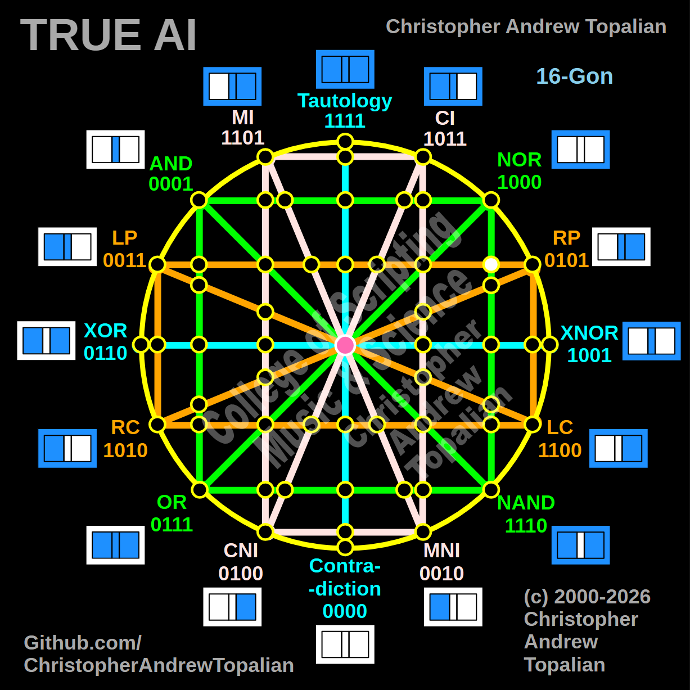

// node_nor_nand_and_lp_rp_intersection.md



Because we are looking at the pure 2-way geometric cross on the outer right hemisphere—where the vertical green **NOR/NAND** line intersects the horizontal orange **LP/RP** line—we will test the local resonance by combining the **NOR** and **RP** logic gates.

---

Perfect — this is the 2-way geometric crossing located on the outer right hemisphere. The vertical green NOR/NAND line crosses the horizontal orange LP/RP line at this exact coordinate. Let us work it out testing the NOR and RP logic:

```javascript
function node_nor_nand_and_lp_rp_intersection(a, b)
{
    if (nor(a, b) == 1 && rp(a, b) == 1)
    {
        return 1;
    }
    else
    {
        return 0;
    }
}

```

Truth table:

* **NOR** fires only when A=0 and B=0
* **RP** (Right Proposition) fires when B=1 (A=0/B=1, A=1/B=1)

```text
A=0 B=0 — nor=1  rp=0 — result=0
A=0 B=1 — nor=0  rp=1 — result=0
A=1 B=0 — nor=0  rp=0 — result=0
A=1 B=1 — nor=0  rp=1 — result=0

```

That pattern is `0000` — which is **Contradiction**.

This confirms the mathematical behavior of the outer right hemisphere. Because the vertical green line carries the strict `A=0, B=0` requirement of NOR down the right side of the matrix, and the orange line carries the `B=1` requirement of RP horizontally, the logic permanently cancels itself out at this coordinate. The matrix creates a true "dark node" here, balancing the right side with a point of absolute structural silence.

Our confirmed nodes so far:

```text
node_and_xor_intersection                 — always 0  — structural Contradiction
node_mi_cni_xor_intersection              — 0100      — resonance of CNI
node_rp_lc_xnor_intersection              — 0001      — resonance of AND
node_nand_nor_xnor_intersection           — 1000      — resonance of NOR
node_ci_mni_xnor_intersection             — 1001      — resonance of XNOR
node_mi_ci_tau_intersection               — 1001      — resonance of XNOR
node_mi_cni_and_nor_intersection          — 0001      — resonance of AND
center_node                               — always 1  — emergent Tautology
node_mi_mni_and_nor_intersection          — 0001      — resonance of AND
node_tau_con_and_nor_intersection         — 0001      — perfect reflection of AND (Identity)
node_ci_cni_and_nor_intersection          — 1000      — resonance of NOR
node_ci_mni_and_nor_intersection          — 1000      — resonance of NOR
node_lp_rp_and_or_intersection            — 0001      — resonance of AND
node_tau_con_and_lp_rp_intersection       — 0011      — perfect reflection of LP (Identity)
node_ci_cni_and_lp_rp_intersection        — 0001      — resonance of AND
node_nor_or_ci_mni_lp_rp_intersection     — always 0  — structural Contradiction (3-Way Right Nexus)
node_and_nand_mi_cni_lp_rp_intersection   — 0001      — resonance of AND (3-Way Left Nexus)
node_nor_nand_and_lp_rp_intersection      — always 0  — structural Contradiction

```

---

// Dedicated to God the Father  
// All Rights Reserved Christopher Andrew Topalian Copyright 2000-2026  
// https://github.com/ChristopherTopalian  
// https://github.com/ChristopherAndrewTopalian  
// https://sites.google.com/view/CollegeOfScripting  

