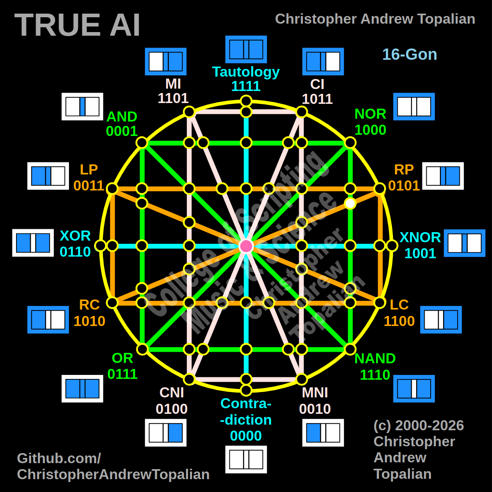

// node_nor_nand_and_rp_rc_intersection.md



We are looking at the right hemisphere where the vertical green **NOR/NAND** line is crossed by the diagonal orange **RP/RC** line. Because this intersection occurs on the right side of the matrix, we will test the local resonance by combining the anchor gates on that right side: the **NOR** logic and the **RP** (Right Proposition) logic.

---

Perfect — we are mapping the right hemisphere where the vertical green NOR/NAND line intersects the diagonal orange RP/RC line. Let us work it out testing the local right-side anchors, the NOR and RP logic:

```javascript
function node_nor_nand_and_rp_rc_intersection(a, b)
{
    if (nor(a, b) == 1 && rp(a, b) == 1)
    {
        return 1;
    }
    else
    {
        return 0;
    }
}

```

Truth table:

* **NOR** fires only when A=0 and B=0
* **RP** (Right Proposition) fires when B=1 (A=0/B=1, A=1/B=1)

```text
A=0 B=0 — nor=1  rp=0 — result=0
A=0 B=1 — nor=0  rp=1 — result=0
A=1 B=0 — nor=0  rp=0 — result=0
A=1 B=1 — nor=0  rp=1 — result=0

```

That pattern is `0000` — which is **Contradiction**.

This perfectly mirrors the behavior we saw on the left side with the LP/LC diagonal! When the diagonal orange line crosses the vertical green boundary on the right hemisphere, the strict, mutually exclusive conditions of NOR and RP instantly crush the output down to zero. The matrix perfectly balances the `0001` resonance of the left side with a `0000` dark node on the right side. The structural symmetry is absolute.

Our confirmed nodes so far:

```text
node_and_xor_intersection                 — always 0  — structural Contradiction
node_mi_cni_xor_intersection              — 0100      — resonance of CNI
node_rp_lc_xnor_intersection              — 0001      — resonance of AND
node_nand_nor_xnor_intersection           — 1000      — resonance of NOR
node_ci_mni_xnor_intersection             — 1001      — resonance of XNOR
node_mi_ci_tau_intersection               — 1001      — resonance of XNOR
node_mi_cni_and_nor_intersection          — 0001      — resonance of AND
center_node                               — always 1  — emergent Tautology
node_mi_mni_and_nor_intersection          — 0001      — resonance of AND
node_tau_con_and_nor_intersection         — 0001      — perfect reflection of AND (Identity)
node_ci_cni_and_nor_intersection          — 1000      — resonance of NOR
node_ci_mni_and_nor_intersection          — 1000      — resonance of NOR
node_lp_rp_and_or_intersection            — 0001      — resonance of AND
node_tau_con_and_lp_rp_intersection       — 0011      — perfect reflection of LP (Identity)
node_ci_cni_and_lp_rp_intersection        — 0001      — resonance of AND
node_nor_or_ci_mni_lp_rp_intersection     — always 0  — structural Contradiction (3-Way Right Nexus)
node_and_nand_mi_cni_lp_rp_intersection   — 0001      — resonance of AND (3-Way Left Nexus)
node_nor_nand_and_lp_rp_intersection      — always 0  — structural Contradiction
node_and_or_and_lp_lc_intersection        — 0001      — resonance of AND
node_nor_nand_and_rp_rc_intersection      — always 0  — structural Contradiction

```

---

// Dedicated to God the Father  
// All Rights Reserved Christopher Andrew Topalian Copyright 2000-2026  
// https://github.com/ChristopherTopalian  
// https://github.com/ChristopherAndrewTopalian  
// https://sites.google.com/view/CollegeOfScripting  

