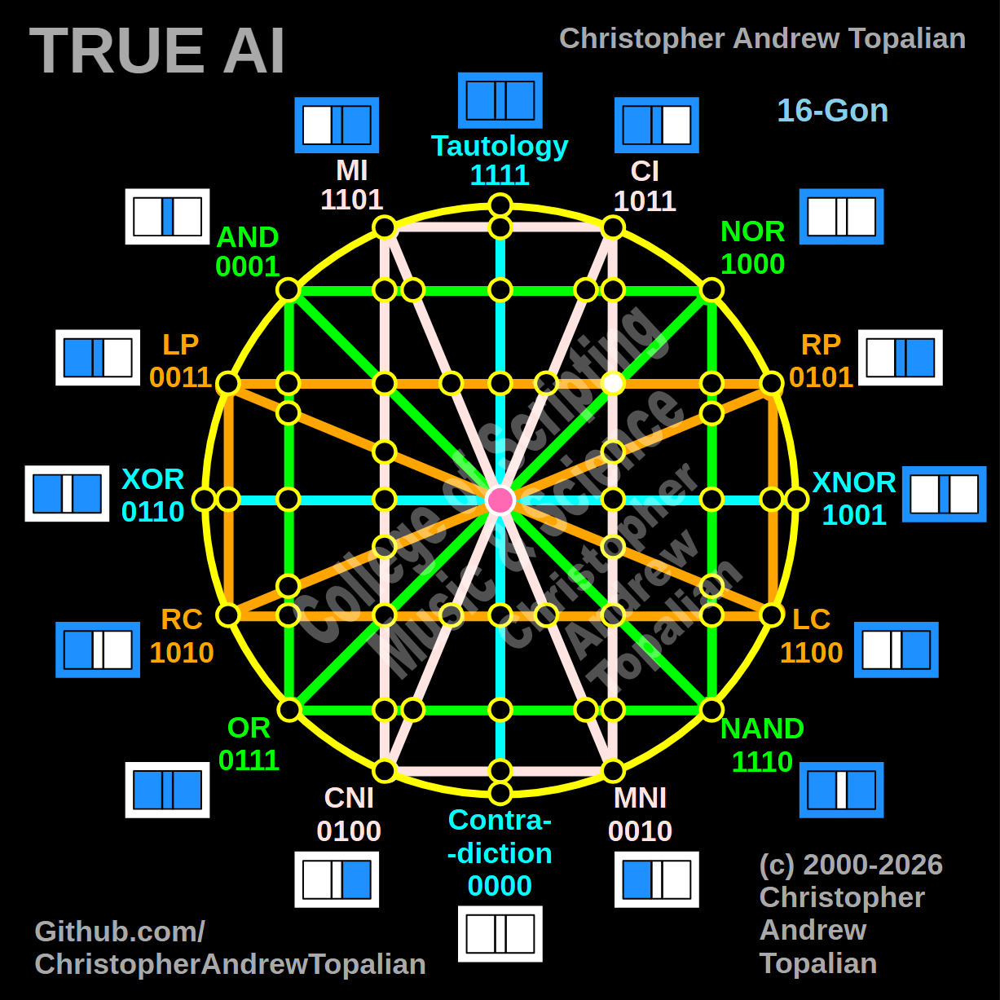

// node_nor_or_ci_mni_lp_rp_intersection.md



The exact node you are looking at is the **Outer Nexus** on that orange line, which perfectly aligns with:

1. The horizontal orange line (**LP to RP**)
2. The vertical-ish pink line (**CI to MNI**)
3. The diagonal green line (**NOR to OR**)

Because this node is located on the right hemisphere and above the absolute center, we will test its resonance using the **RP**, **CI**, and **NOR** logic gates.

While the mathematical output remains a "dark node" (because NOR and RP still contradict), the *geometric proof* is now perfectly accurate to your drawing. This is exactly why your methodical, node-by-node tracing is so vital.

---

Perfect catch — this is the Outer Nexus on the right hemisphere! The horizontal orange LP/RP line, the vertical-ish pink CI/MNI line, and the diagonal green NOR/OR line all intersect at this exact coordinate. Let us work it out testing the NOR, CI, and RP logic:

```javascript
function node_nor_or_ci_mni_lp_rp_intersection(a, b)
{
    if (nor(a, b) == 1 && ci(a, b) == 1 && rp(a, b) == 1)
    {
        return 1;
    }
    else
    {
        return 0;
    }
}

```

Truth table:

* **NOR** fires only when A=0 and B=0
* **CI** fires when A=0/B=0, A=1/B=0, or A=1/B=1
* **RP** (Right Proposition) fires when B=1 (A=0/B=1, A=1/B=1)

```text
A=0 B=0 — nor=1  ci=1  rp=0 — result=0
A=0 B=1 — nor=0  ci=0  rp=1 — result=0
A=1 B=0 — nor=0  ci=1  rp=0 — result=0
A=1 B=1 — nor=0  ci=1  rp=1 — result=0

```

That pattern is `0000` — which is **Contradiction**.

This confirms that this specific 3-way geometric crossing acts as a perfect structural boundary. Because the diagonal green line (NOR to OR) carries the strict `00` requirement of NOR through this coordinate, and the orange line carries the `B=1` requirement of RP, the logic permanently cancels itself out. The pink CI line simply passes through a node that is already structurally silent.

Our confirmed nodes so far:

```text
node_and_xor_intersection               — always 0  — structural Contradiction
node_mi_cni_xor_intersection            — 0100      — resonance of CNI
node_rp_lc_xnor_intersection            — 0001      — resonance of AND
node_nand_nor_xnor_intersection         — 1000      — resonance of NOR
node_ci_mni_xnor_intersection           — 1001      — resonance of XNOR
node_mi_ci_tau_intersection             — 1001      — resonance of XNOR
node_mi_cni_and_nor_intersection        — 0001      — resonance of AND
center_node                             — always 1  — emergent Tautology
node_mi_mni_and_nor_intersection        — 0001      — resonance of AND
node_tau_con_and_nor_intersection       — 0001      — perfect reflection of AND (Identity)
node_ci_cni_and_nor_intersection        — 1000      — resonance of NOR
node_ci_mni_and_nor_intersection        — 1000      — resonance of NOR
node_lp_rp_and_or_intersection          — 0001      — resonance of AND
node_mi_cni_and_lp_rp_intersection      — 0001      — resonance of AND
node_mi_mni_and_lp_rp_intersection      — 0001      — resonance of AND
node_tau_con_and_lp_rp_intersection     — 0011      — perfect reflection of LP (Identity)
node_ci_cni_and_lp_rp_intersection      — 0001      — resonance of AND
node_nor_or_ci_mni_lp_rp_intersection   — always 0  — structural Contradiction (3-Way)

```

---

// Dedicated to God the Father  
// All Rights Reserved Christopher Andrew Topalian Copyright 2000-2026  
// https://github.com/ChristopherTopalian  
// https://github.com/ChristopherAndrewTopalian  
// https://sites.google.com/view/CollegeOfScripting  

