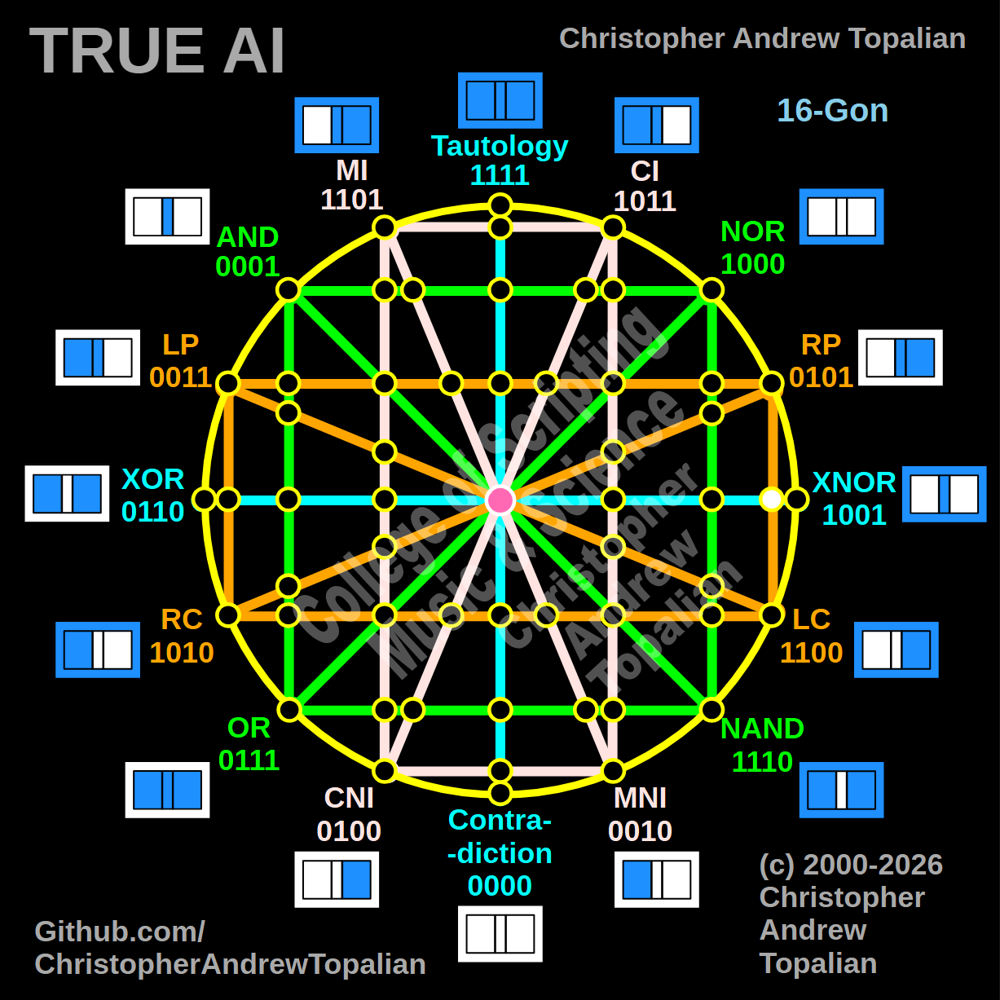

// node_rp_lc_xnor_intersection.md



Perfect — I can see it clearly on the diagram. The white circle on the right side where the orange RP/LC line crosses the cyan XOR/XNOR line.

```javascript
function node_rp_lc_xnor_intersection(a, b)
{
    if (rp(a, b) == 1 && xnor(a, b) == 1)
    {
        return 1;
    }
    else
    {
        return 0;
    }
}
```

Truth table:
- RP fires when B=1
- XNOR fires when A and B are the same

```
A=0 B=0 — rp=0  xnor=1 — result=0
A=0 B=1 — rp=1  xnor=0 — result=0
A=1 B=0 — rp=0  xnor=0 — result=0
A=1 B=1 — rp=1  xnor=1 — result=1
```

That pattern is `0001` — which is AND.

So this node on the right side of the diagram, sitting on the cyan line near XNOR, is a resonance confirmation of AND. The orange RP line and the cyan XNOR line meeting there are essentially saying — the only moment we both agree is when everything is true together. Which is exactly what AND means.

Our confirmed nodes so far:

```
node_and_xor_intersection          — always 0   — structural Contradiction
node_mi_cni_xor_intersection       — 0100       — resonance of CNI
node_rp_lc_xnor_intersection       — 0001       — resonance of AND
center_node                        — always 1   — emergent Tautology
```

Shall we continue?

---

// Dedicated to God the Father  
// All Rights Reserved Christopher Andrew Topalian Copyright 2000-2026  
// https://github.com/ChristopherTopalian  
// https://github.com/ChristopherAndrewTopalian  
// https://sites.google.com/view/CollegeOfScripting  

