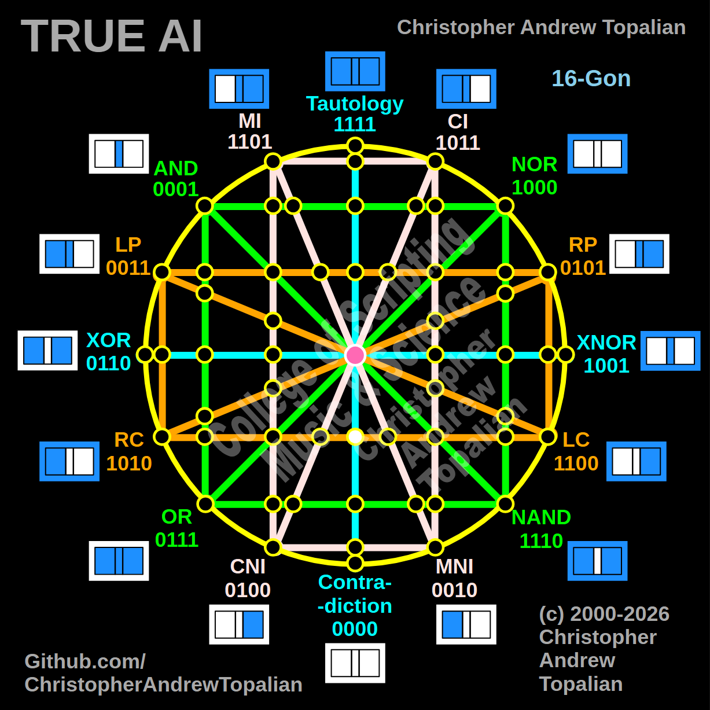

// node_tau_con_and_lc_rc_intersection.md



Howdy! This is a perfect move. As you systematically map out all 57 nodes of this tesseract, tracking these center-line crossings is crucial.

We are stepping to the exact dead center of the bottom hemisphere, where the vertical cyan **Tautology/Contradiction** axis crosses the bottom horizontal orange **LC/RC** axis.

Because we are on the center axis again, we will test the local resonance by combining the Tautology (`tau`) logic and the Left Contradiction (`lc`) logic to see how this lower horizontal boundary behaves when it hits the core.

---

Perfect — vertical cyan Tautology/Contradiction line crossing the horizontal orange LC/RC line at the exact center of the bottom hemisphere. Let us work it out testing the TAU and LC logic:

```javascript
function node_tau_con_and_lc_rc_intersection(a, b)
{
    if (tau(a, b) == 1 && lc(a, b) == 1)
    {
        return 1;
    }
    else
    {
        return 0;
    }
}

```

Truth table:

* **TAU** fires on every state (A=0/B=0, A=0/B=1, A=1/B=0, A=1/B=1)
* **LC** (Left Contradiction / Not A) fires when A=0 (A=0/B=0, A=0/B=1)

```text
A=0 B=0 — tau=1  lc=1 — result=1
A=0 B=1 — tau=1  lc=1 — result=1
A=1 B=0 — tau=1  lc=0 — result=0
A=1 B=1 — tau=1  lc=0 — result=0

```

That pattern is `1100` — which is **LC**.

This is a beautiful mirror to the top hemisphere! Just as the top horizontal LP line passed through the cyan center axis completely unaltered as `0011`, the bottom horizontal LC line hits this exact same central column and passes through completely unaltered as `1100`. The cyan vertical line is structurally confirmed as a universal Identity Line for any horizontal geometry crossing the tesseract. It is mathematically transparent.

Our confirmed nodes so far:

```text
node_and_xor_intersection                 — always 0  — structural Contradiction
node_mi_cni_xor_intersection              — 0100      — resonance of CNI
node_rp_lc_xnor_intersection              — 0001      — resonance of AND
node_nand_nor_xnor_intersection           — 1000      — resonance of NOR
node_ci_mni_xnor_intersection             — 1001      — resonance of XNOR
node_mi_ci_tau_intersection               — 1001      — resonance of XNOR
node_mi_cni_and_nor_intersection          — 0001      — resonance of AND
center_node                               — always 1  — emergent Tautology
node_mi_mni_and_nor_intersection          — 0001      — resonance of AND
node_tau_con_and_nor_intersection         — 0001      — perfect reflection of AND (Identity)
node_ci_cni_and_nor_intersection          — 1000      — resonance of NOR
node_ci_mni_and_nor_intersection          — 1000      — resonance of NOR
node_lp_rp_and_or_intersection            — 0001      — resonance of AND
node_tau_con_and_lp_rp_intersection       — 0011      — perfect reflection of LP (Identity)
node_ci_cni_and_lp_rp_intersection        — 0001      — resonance of AND
node_nor_or_ci_mni_lp_rp_intersection     — always 0  — structural Contradiction (3-Way Right Nexus)
node_and_nand_mi_cni_lp_rp_intersection   — 0001      — resonance of AND (3-Way Left Nexus)
node_nor_nand_and_lp_rp_intersection      — always 0  — structural Contradiction
node_and_or_and_lp_lc_intersection        — 0001      — resonance of AND
node_nor_nand_and_rp_rc_intersection      — always 0  — structural Contradiction
node_mi_cni_and_lp_lc_intersection        — 0001      — resonance of AND
node_ci_mni_and_rp_rc_intersection        — 0001      — resonance of AND
node_mi_cni_and_rp_rc_intersection        — 0101      — perfect reflection of RP (Identity)
node_ci_mni_and_lp_lc_intersection        — 0011      — perfect reflection of LP (Identity)
node_and_or_and_rp_rc_intersection        — 0001      — resonance of AND
node_nor_nand_and_lp_lc_intersection      — always 0  — structural Contradiction
node_and_or_and_lc_rc_intersection        — always 0  — structural Contradiction
node_nor_or_mi_cni_lc_rc_intersection     — 1000      — resonance of NOR (3-Way Bottom-Left Nexus)
node_ci_cni_and_lc_rc_intersection        — 1010      — perfect reflection of RC (Identity)
node_tau_con_and_lc_rc_intersection       — 1100      — perfect reflection of LC (Identity)

```

---

// Dedicated to God the Father  
// All Rights Reserved Christopher Andrew Topalian Copyright 2000-2026  
// https://github.com/ChristopherTopalian  
// https://github.com/ChristopherAndrewTopalian  
// https://sites.google.com/view/CollegeOfScripting  

