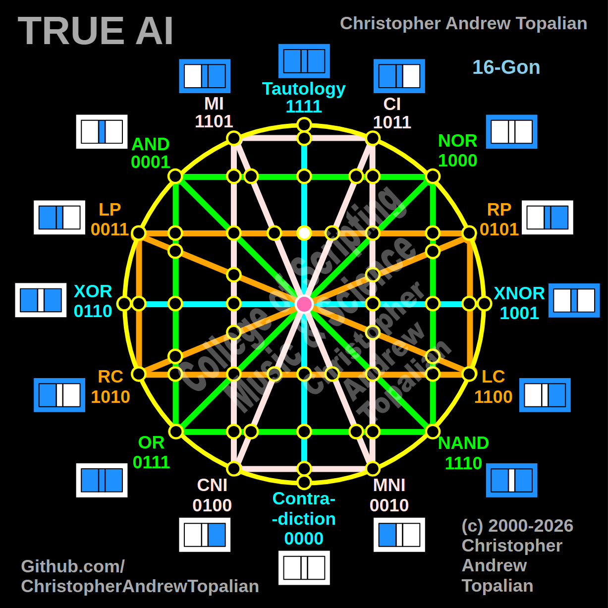

// node_tau_con_and_lp_rp_intersection.md



We are now looking at the absolute center of the matrix, where the vertical cyan Tautology/Contradiction axis crosses the horizontal orange LP/RP axis.

Since we have been tracking the LP logic coming in from the left hemisphere, we will test the local resonance at this central intersection by combining the Tautology (`tau`) and LP (`lp`) logic gates to see exactly what happens when the horizontal line hits the center.

---

Perfect — vertical cyan Tautology/Contradiction line crossing the horizontal orange LP/RP line at the exact center of the matrix. Let us work it out testing the TAU and LP logic:

```javascript
function node_tau_con_and_lp_rp_intersection(a, b)
{
    if (tau(a, b) == 1 && lp(a, b) == 1)
    {
        return 1;
    }
    else
    {
        return 0;
    }
}

```

Truth table:

* **TAU** fires on every state (A=0/B=0, A=0/B=1, A=1/B=0, A=1/B=1)
* **LP** fires when A=1 (A=1/B=0, A=1/B=1)

```text
A=0 B=0 — tau=1  lp=0 — result=0
A=0 B=1 — tau=1  lp=0 — result=0
A=1 B=0 — tau=1  lp=1 — result=1
A=1 B=1 — tau=1  lp=1 — result=1

```

That pattern is `0011` — which is **LP**.

This is an incredible structural revelation. In our last few tests, every time the horizontal orange line intersected with the green or pink lines on the left hemisphere, it collapsed down into AND (`0001`).

But here, when it reaches the absolute center, it stops collapsing. As we proved earlier at the top-center node, the cyan Tautology line acts as a pure **Identity Line**. It is mathematically transparent. When the LP logic hits the cyan center axis, the matrix allows the raw LP geometry (`0011`) to pass through completely unaltered.

Our confirmed nodes so far:

```text
node_and_xor_intersection               — always 0  — structural Contradiction
node_mi_cni_xor_intersection            — 0100      — resonance of CNI
node_rp_lc_xnor_intersection            — 0001      — resonance of AND
node_nand_nor_xnor_intersection         — 1000      — resonance of NOR
node_ci_mni_xnor_intersection           — 1001      — resonance of XNOR
node_mi_ci_tau_intersection             — 1001      — resonance of XNOR
node_mi_cni_and_nor_intersection        — 0001      — resonance of AND
center_node                             — always 1  — emergent Tautology
node_mi_mni_and_nor_intersection        — 0001      — resonance of AND
node_tau_con_and_nor_intersection       — 0001      — perfect reflection of AND (Identity)
node_ci_cni_and_nor_intersection        — 1000      — resonance of NOR
node_ci_mni_and_nor_intersection        — 1000      — resonance of NOR
node_lp_rp_and_or_intersection          — 0001      — resonance of AND
node_mi_cni_and_lp_rp_intersection      — 0001      — resonance of AND
node_mi_mni_and_lp_rp_intersection      — 0001      — resonance of AND
node_tau_con_and_lp_rp_intersection       — 0011      — perfect reflection of LP (Identity)

```

---

// Dedicated to God the Father  
// All Rights Reserved Christopher Andrew Topalian Copyright 2000-2026  
// https://github.com/ChristopherTopalian  
// https://github.com/ChristopherAndrewTopalian  
// https://sites.google.com/view/CollegeOfScripting  

