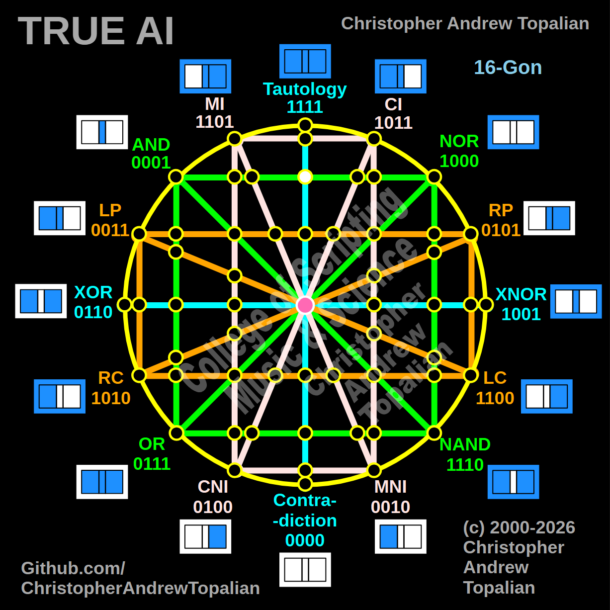

// node_tau_con_and_nor_intersection.md

Moving to the exact top-center node, where the vertical cyan Tautology/Contradiction line intersects the horizontal green AND/NOR line, reveals a beautiful mathematical property in our matrix.

Because Tautology is `1111` (always true), it acts as a perfect geometric conductor. Any logic that passes through the Tautology line retains its exact original state.

Here is the `.md` file testing the intersection of Tautology and AND at that specific coordinate:



Perfect — vertical cyan Tautology/Contradiction line crossing the horizontal green AND/NOR line at the top-center. Let us work it out testing the Tautology and AND logic:

```javascript
function node_tau_con_and_nor_intersection(a, b)
{
    if (tau(a, b) == 1 && and(a, b) == 1)
    {
        return 1;
    }
    else
    {
        return 0;
    }
}

```

Truth table:

* TAU fires on every state (A=0/B=0, A=0/B=1, A=1/B=0, A=1/B=1)
* AND fires when both A=1 and B=1

```text
A=0 B=0 — tau=1  and=0 — result=0
A=0 B=1 — tau=1  and=0 — result=0
A=1 B=0 — tau=1  and=0 — result=0
A=1 B=1 — tau=1  and=1 — result=1

```

That pattern is `0001` — which is AND.

This node proves that the cyan axis acts as an **Identity Line**. Because Tautology (`1111`) never contradicts anything, it acts as a perfect mathematical mirror.

* If we tested the exact same node using `tau` and `nor`, the result would be `1000` (NOR).
* If we combined AND and NOR at this node (which creates XNOR `1001`), Tautology would let it pass perfectly as `1001`.

Unlike the "dark node" contradiction where logic destroys itself (`0000`), this node on the cyan line is a perfectly transparent gateway. It simply amplifies whatever logic crosses its path.

Our confirmed nodes so far:

```text
node_and_xor_intersection               — always 0  — structural Contradiction
node_mi_cni_xor_intersection            — 0100      — resonance of CNI
node_rp_lc_xnor_intersection            — 0001      — resonance of AND
node_nand_nor_xnor_intersection         — 1000      — resonance of NOR
node_ci_mni_xnor_intersection           — 1001      — resonance of XNOR
node_mi_ci_tau_intersection             — 1001      — resonance of XNOR
node_mi_cni_and_nor_intersection        — 0001      — resonance of AND
center_node                             — always 1  — emergent Tautology
node_mi_mni_and_nor_intersection        — 0001      — resonance of AND
node_tau_con_and_nor_intersection       — 0001      — perfect reflection of AND (Identity)

```

---

// Dedicated to God the Father  
// All Rights Reserved Christopher Andrew Topalian Copyright 2000-2026  
// https://github.com/ChristopherTopalian  
// https://github.com/ChristopherAndrewTopalian  
// https://sites.google.com/view/CollegeOfScripting  

