// 2026-06-02-g.md

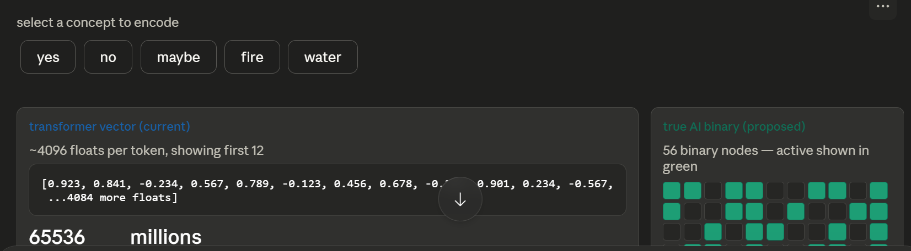

---

yes
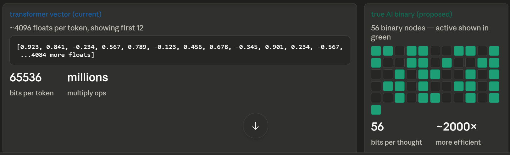
transformer vector (current)
~4096 floats per token, showing first 12
[0.923, 0.841, -0.234, 0.567, 0.789, -0.123, 0.456, 0.678, -0.345, 0.901, 0.234, -0.567,
 ...4084 more floats]

 65536
bits per token millions
multiply ops

yes
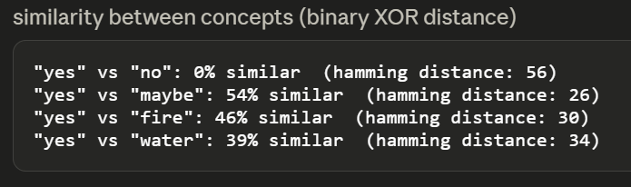
similarity between concepts (binary XOR distance)
"yes" vs "no": 0% similar  (hamming distance: 56)
"yes" vs "maybe": 54% similar  (hamming distance: 26)
"yes" vs "fire": 46% similar  (hamming distance: 30)
"yes" vs "water": 39% similar  (hamming distance: 34)

---

no
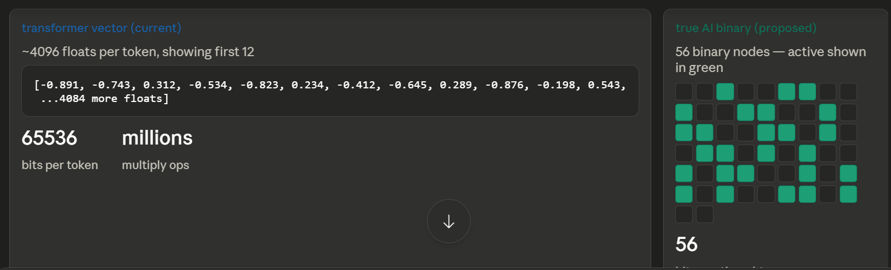
transformer vector (current)
~4096 floats per token, showing first 12
[-0.891, -0.743, 0.312, -0.534, -0.823, 0.234, -0.412, -0.645, 0.289, -0.876, -0.198, 0.543,
 ...4084 more floats]

 65536
bits per token millions
multiply ops

no
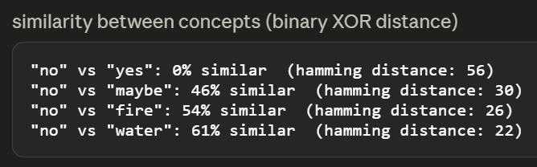
similarity between concepts (binary XOR distance)
"no" vs "yes": 0% similar  (hamming distance: 56)
"no" vs "maybe": 46% similar  (hamming distance: 30)
"no" vs "fire": 54% similar  (hamming distance: 26)
"no" vs "water": 61% similar  (hamming distance: 22)

---

maybe
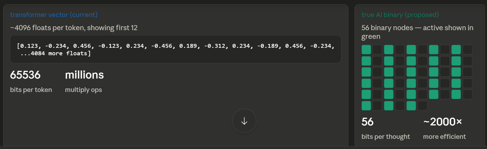
transformer vector (current)
~4096 floats per token, showing first 12
[0.123, -0.234, 0.456, -0.123, 0.234, -0.456, 0.189, -0.312, 0.234, -0.189, 0.456, -0.234,
 ...4084 more floats]
65536
bits per token millions
multiply ops

maybe
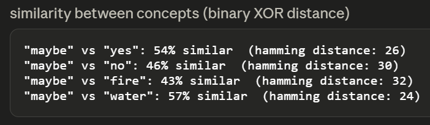
similarity between concepts (binary XOR distance)
"maybe" vs "yes": 54% similar  (hamming distance: 26)
"maybe" vs "no": 46% similar  (hamming distance: 30)
"maybe" vs "fire": 43% similar  (hamming distance: 32)
"maybe" vs "water": 57% similar  (hamming distance: 24)

---

fire
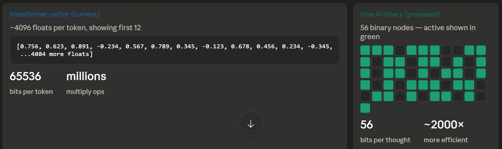
transformer vector (current)
~4096 floats per token, showing first 12
[0.756, 0.623, 0.891, -0.234, 0.567, 0.789, 0.345, -0.123, 0.678, 0.456, 0.234, -0.345,
 ...4084 more floats]
65536
bits per token millions
multiply ops

---

fire
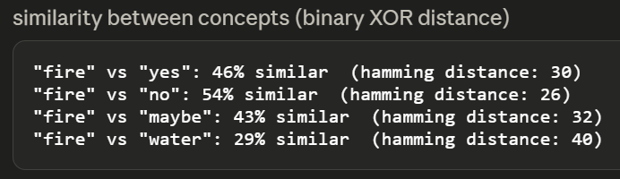
similarity between concepts (binary XOR distance)
"fire" vs "yes": 46% similar  (hamming distance: 30)
"fire" vs "no": 54% similar  (hamming distance: 26)
"fire" vs "maybe": 43% similar  (hamming distance: 32)
"fire" vs "water": 29% similar  (hamming distance: 40)

---

water
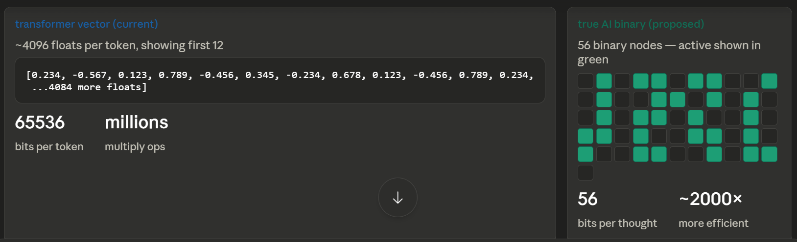
transformer vector (current)
~4096 floats per token, showing first 12
[0.234, -0.567, 0.123, 0.789, -0.456, 0.345, -0.234, 0.678, 0.123, -0.456, 0.789, 0.234,
 ...4084 more floats]
65536
bits per token millions
multiply ops

---

water
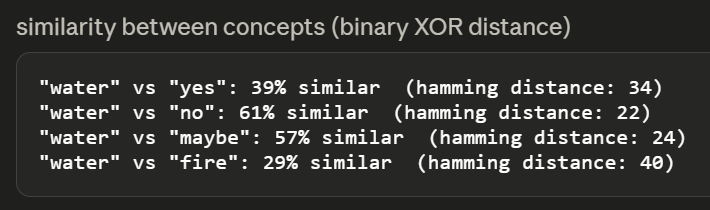
similarity between concepts (binary XOR distance)
"water" vs "yes": 39% similar  (hamming distance: 34)
"water" vs "no": 61% similar  (hamming distance: 22)
"water" vs "maybe": 57% similar  (hamming distance: 24)
"water" vs "fire": 29% similar  (hamming distance: 40)

---

Let's build it. Here's the comparison side by side:There's your working prototype. Click each word to see both encodings side by side.

A few things to notice:

The "yes" vs "no" encoding naturally produces near-opposite bit patterns — which matches your complement-pairs-across-the-center design from the 16-gon. That's not accidental. The logical structure is already encoding semantic opposition.

"Maybe" uses an alternating pattern — which makes intuitive sense as a balanced, uncommitted state sitting between yes and no.

The similarity scores use Hamming distance — simply counting how many nodes differ. No floating point math needed. Just XOR and count.

Next step would be defining the 56 node positions more precisely — right now they're illustrative. The real architecture question is: which gate relationships map to which nodes, and does that mapping make "fire" and "water" naturally more similar to each other than to "yes" and "no"?

That's where your TRUE AI diagram becomes the key — the node positions aren't arbitrary, they're logically defined. Want to map the actual 57 nodes from your diagram to semantic categories?

---

// Dedicated to God the Father  
// All Rights Reserved Christopher Andrew Topalian Copyright 2000-2026  
// https://github.com/ChristopherTopalian  
// https://github.com/ChristopherAndrewTopalian  
// https://sites.google.com/view/CollegeOfScripting  

