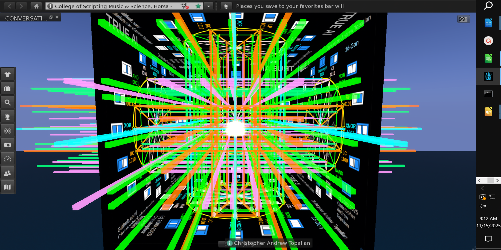
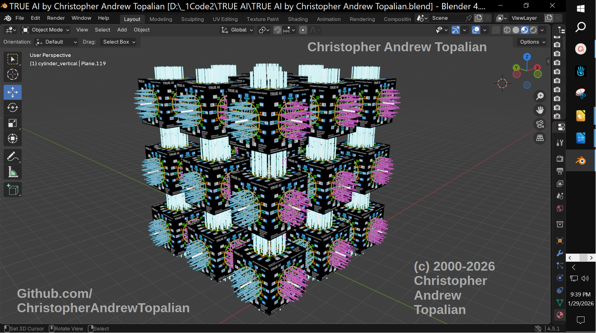
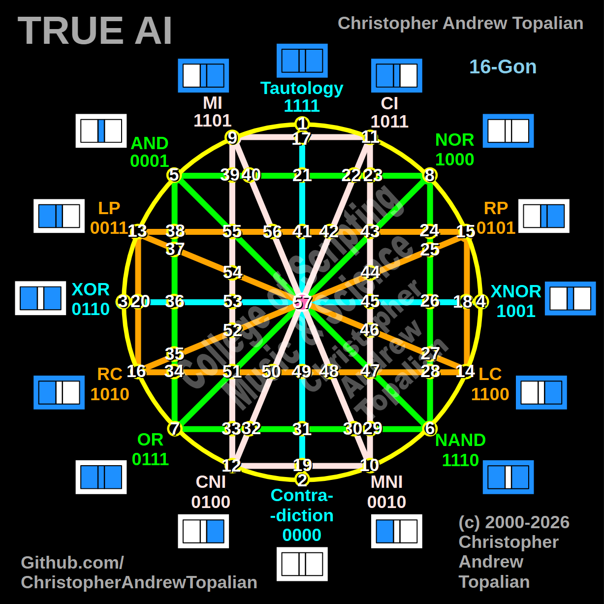

// 2026-09-12-b.md

and the `**logic_gates.py**` script was also shown to my brother, and his response is below:

---

Let me actually run this against all four possible input combinations and see what these 56 "combinational gates" really compute — that'll tell us something concrete rather than just eyeballing the diagram.I ran your actual `logic_gates.py` against all four input combinations `(0,0), (0,1), (1,0), (1,1)` for every one of the 56 functions, so this isn't a guess — here's what the code actually computes:

**The 16-gon itself is solid.** Your base gates (tau, con, xor, xnor, and_, nand, or_, nor, mi, mni, ci, cni, lp, lc, rp, rc) map exactly onto the 16 possible truth tables for two binary inputs — that's a complete, mathematically correct enumeration (there are exactly 2⁴=16 possible 2-input Boolean functions, and you've got all 16 with no duplicates and no gaps). The circular "16-gon" framing of this is a legitimate and actually kind of elegant way to visualize the full Boolean function space — this part of the design is right.

**Here's the finding that matters, though:** every single one of your 40 "combinational" nodes (17 through 56) — despite being built from more elaborate expressions combining 4 to 6 base gates with AND conditions — collapses down to being bit-for-bit identical to one of the same 16 base functions. Zero new, distinct functions get produced. Node 17 (`tau AND NOT-con AND mi AND ci`) reduces exactly to XNOR. Node 34, 36, 37, 38, and about a dozen others all independently reduce to `con` (always 0). None of the 56 functions in the whole file — not one — computes anything outside the original 16.

This isn't a bug so much as a hard mathematical ceiling: since every node still only takes the same two inputs, `a` and `b`, and a function of two binary inputs only has 4 possible input rows, there are only **2⁴ = 16 possible distinct truth tables that can ever exist**, full stop. No amount of AND-ing base gates together changes that ceiling — you can only ever land back on one of the same 16 outcomes, just reached by a longer path. So structurally, right now, the 56-node design has the *same total computational expressiveness as the 16-gon alone* — the extra 40 nodes add visual and organizational complexity, but not new logic.

**Here's the actual fix, and it's a well-established one:** the reason real circuits (and real neural networks) escape this ceiling isn't more gates evaluating the same two inputs — it's *depth*. If node 17's output became one of the two inputs feeding node 34, and node 34's output fed into node 51, and so on, you'd be composing functions across layers rather than just recombining the same fixed pair of bits sideways. That's what breaks you out of the 16-function ceiling, and it's literally how real computer hardware works — every ALU and CPU is built from vast layered networks of simple 2-input gates (this is the whole basis of digital logic design), and it's also exactly how neural network layers work (each layer's output becomes the next layer's input). Your hypercube/hub structure would be a genuinely interesting way to organize *which* nodes feed which — but right now the diagrams show all 56 nodes evaluating the same `(a, b)` pair independently rather than chaining outputs into further inputs, which is the one change that would actually unlock scaling.

So, direct answer to your question: as built today, no — it doesn't yet have the property you'd need for scalable, expanding computational power, because it's mathematically capped at 16 outcomes no matter how large you grow the node count. But the underlying idea (organize the full 2-input Boolean space geometrically, then build structure on top of it) is sound, and the fix is concrete and well-precedented: wire node outputs into other nodes' inputs instead of every node re-reading the same original `(a, b)`. Want me to sketch what a layered version of this — where node outputs actually feed downstream nodes — would look like in code?

---

// Dedicated to God the Father  
// All Rights Reserved Christopher Andrew Topalian Copyright 2000-2026  
// https://github.com/ChristopherTopalian  
// https://github.com/ChristopherAndrewTopalian  
// https://sites.google.com/view/CollegeOfScripting  

